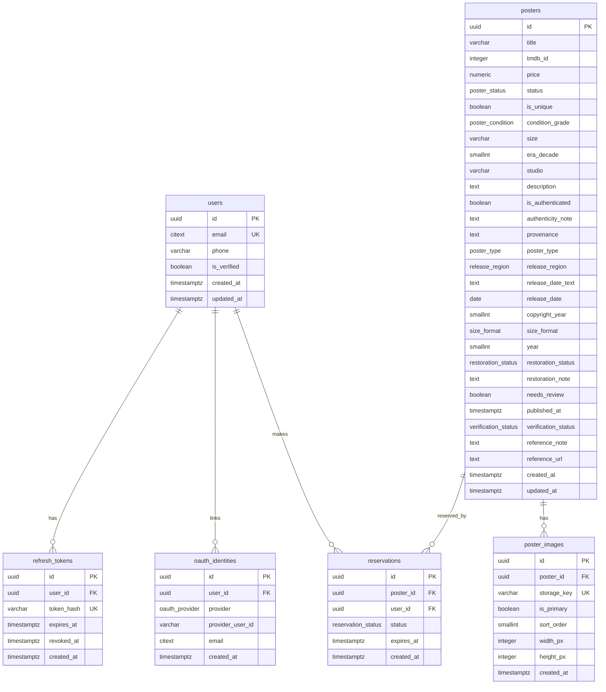

# Database Design — Poster Nung Backend (PostgreSQL)

> ขอบเขต: **Core F1–F3** (Authentication, Poster Catalog, Cart & Reservation)
> โมเดล: **Single-store MVP โดยเจตนา** (เสร็จไว, ไม่ over-engineer) — ออกแบบให้ขยายเป็น multi-vendor marketplace ได้แบบ additive ในอนาคต (ดู §8 Evolution Path)
> Deliverable: design doc + ERD (ยังไม่แตะ SQLAlchemy models)
> Source of truth: `CLAUDE.md` feature templates F1–F3
> PostgreSQL 16 (ตาม `docker-compose.yml`)

---

## 1. Overview

Backend REST API ของ e-commerce ขายโปสเตอร์หนังต้นฉบับ **ชิ้นเดียวในโลก (สต็อก=1)** ทำให้ schema ต้องรองรับ 2 ความเสี่ยงหลัก:

1. **Unique inventory** — 1 โปสเตอร์ = 1 ชิ้น ห้ามถูกจอง/ขายซ้อน → กันด้วย **row-lock (`FOR UPDATE`) + partial unique index** (2 ชั้น)
2. **ไม่มีข้อมูลบัตรดิบ** — payment อยู่ F4 (นอก scope) แต่ core schema ต้องไม่มี field การเงินอ่อนไหวหลุดเข้ามา

ตารางในรอบนี้: `users`, `refresh_tokens`, `oauth_identities`, `posters`, `poster_images`, `reservations`

> **อัปเดต (migration `a7c4e91b2d38`):** ตาราง `otp_codes`, คอลัมน์ `users.hashed_password` และ enum `otp_purpose`
> **ถูก drop ออกแล้ว** — sign-in ทุกวิธี (email/password, phone-OTP, Google) ทำที่ Firebase ฝั่ง client
> backend แค่ verify ID token (ดู [`api-contract-f1-f3.md` §6](./api-contract-f1-f3.md)) ส่วนที่เกี่ยวกับ
> local password/OTP ด้านล่างเก็บไว้เป็นบันทึกการออกแบบเดิมเท่านั้น

---

## 2. Conventions (ใช้ทุกตาราง)

| หัวข้อ | มาตรฐาน |
|---|---|
| Primary key | `id UUID` default `gen_random_uuid()` (built-in ตั้งแต่ PG13 — ไม่ต้องพึ่ง extension) |
| Money | `NUMERIC(12,2)` + `CHECK (>= 0)` |
| Timestamp | `TIMESTAMPTZ` เสมอ (ไม่ใช้ naive `timestamp`); `created_at` / `updated_at` default `now()` |
| Foreign key | ระบุ `ON DELETE` ชัดเจน — `CASCADE` สำหรับ child ที่ตายตามได้, `RESTRICT` สำหรับ reference สำคัญ |
| Naming | table = พหูพจน์ snake_case, FK = `<parent>_id`, index = `ix_<table>_<cols>`, unique = `uq_<table>_<cols>` |

---

## 3. Enum Types

```sql
CREATE TYPE poster_status      AS ENUM ('available', 'reserved', 'sold');
CREATE TYPE reservation_status AS ENUM ('active', 'expired', 'converted');
CREATE TYPE otp_purpose        AS ENUM ('registration', 'login');
CREATE TYPE poster_condition   AS ENUM ('mint', 'near_mint', 'very_fine', 'fine', 'very_good', 'good', 'fair', 'poor');

-- ADR-0009 — คุณลักษณะเชิงพรรณนาของโปสเตอร์ (UPPERCASE, ต่างจาก 4 ตัวบนที่เป็น lowercase)
CREATE TYPE poster_type        AS ENUM ('TEASER', 'ADVANCE', 'THEATRICAL', 'RERELEASE', 'UNKNOWN');
CREATE TYPE release_region     AS ENUM ('TH', 'US', 'JP', 'UK', 'INTL', 'UNKNOWN');
CREATE TYPE size_format        AS ENUM ('ONE_SHEET', 'HALF_SHEET', 'INSERT', 'QUAD', 'OTHER', 'UNKNOWN');
CREATE TYPE restoration_status AS ENUM ('NONE', 'RESTORED', 'LINEN_BACKED', 'UNKNOWN');

-- ADR-0014 D21 — เปิดหาแหล่งอ้างอิงแล้วเจอหรือไม่ (ไม่ใช่การรับรองความแท้
-- และไม่ใช่การตัดสินว่าใบไหนต่างจากมาตรฐาน) · NULL = NOT_CHECKED
CREATE TYPE verification_status AS ENUM ('REFERENCE_FOUND', 'NO_REFERENCE_FOUND');
```

> ⚠️ **ยืนยันสเกลก่อน finalize:** ค่าใน `poster_condition` ข้างบนอิงเกรดเชิงพรรณนาที่ใช้กันในวงการ (แนว Heritage Auctions) แต่ยังมีระบบตัวเลข **C1–C10** ที่นิยมเช่นกัน — ควรยืนยันมาตรฐานที่นักสะสมไทย/สากลยอมรับก่อนล็อค (ตรงกับ Open Question ใน PRD) ประเด็นหลักคือ **ต้องเป็น enum เดียวทั้งระบบ** ไม่ใช่ free-text (BR-03) เพื่อให้ marketplace ในอนาคตเทียบสภาพข้ามผู้ขายได้

| enum | ค่า | ใช้ที่ |
|---|---|---|
| `poster_status` | `available` · `reserved` · `sold` | `posters.status` |
| `reservation_status` | `active` · `expired` · `converted` | `reservations.status` |
| `poster_condition` | `mint` · `near_mint` · `very_fine` · `fine` · `very_good` · `good` · `fair` · `poor` | `posters.condition_grade` |
| `poster_type` | `TEASER` · `ADVANCE` · `THEATRICAL` · `RERELEASE` · `UNKNOWN` | `posters.poster_type` |
| `release_region` | `TH` · `US` · `JP` · `UK` · `INTL` · `UNKNOWN` | `posters.release_region` |
| `size_format` | `ONE_SHEET` · `HALF_SHEET` · `INSERT` · `QUAD` · `OTHER` · `UNKNOWN` | `posters.size_format` |
| `restoration_status` | `NONE` · `RESTORED` · `LINEN_BACKED` · `UNKNOWN` | `posters.restoration_status` |
| `verification_status` | `REFERENCE_FOUND` · `NO_REFERENCE_FOUND` | `posters.verification_status` |

> 🔴 **`NULL` ≠ `UNKNOWN` สำหรับ 4 enum ของ ADR-0009 และสำหรับ `verification_status`
> (ADR-0014 D3) ด้วย** — `NULL` = ยังไม่มีใครตรวจโปสเตอร์
> ใบนี้เลย (ค่าเริ่มต้นของทุกแถว) ส่วน `UNKNOWN` = **คนตรวจใบจริงแล้วแต่ตัดสินไม่ได้**
> เขียนได้เฉพาะคน ไม่ใช่ importer/สคริปต์/AI — เหตุผลเต็มดู ADR-0009 D2 อย่าเขียน query
> ที่ปฏิบัติสองค่านี้เหมือนกัน

---

## 4. Tables

### 4.1 `users` — F1 Authentication

| column | type | constraint | หมายเหตุ |
|---|---|---|---|
| `id` | UUID | PK, default `gen_random_uuid()` | |
| `email` | CITEXT | UNIQUE, NULL | case-insensitive unique · NULL ได้สำหรับ phone-only user |
| `phone` | VARCHAR(20) | NULL | |
| `is_verified` | BOOLEAN | NOT NULL default `false` | ยืนยันตัวตนกับ Firebase แล้ว |
| `created_at` | TIMESTAMPTZ | NOT NULL default `now()` | |
| `updated_at` | TIMESTAMPTZ | NOT NULL default `now()` | |

- `email` ใช้ **CITEXT** เพื่อกันสมัครซ้ำแบบ `A@x.com` vs `a@x.com` (ต้องเปิด extension `citext`)
- ไม่มี field รหัสผ่านใดๆ แล้ว — credential อยู่ที่ Firebase ทั้งหมด
- Index: unique บน `email` (มาจาก UNIQUE โดยปริยาย)

---

### 4.2 `otp_codes` — F1 ⚠️ **ถูก drop แล้ว** (เก็บไว้เป็นบันทึกการออกแบบเดิม)

| column | type | constraint | หมายเหตุ |
|---|---|---|---|
| `id` | UUID | PK | |
| `user_id` | UUID | FK → `users(id)` ON DELETE CASCADE, NOT NULL | |
| `code_hash` | VARCHAR(255) | NOT NULL | hash ของ OTP ห้ามเก็บ/log ค่าดิบ |
| `purpose` | otp_purpose | NOT NULL default `'registration'` | |
| `expires_at` | TIMESTAMPTZ | NOT NULL | |
| `consumed_at` | TIMESTAMPTZ | NULL | เวลาที่ใช้ OTP สำเร็จ |
| `attempt_count` | SMALLINT | NOT NULL default `0` | นับครั้งกรอกผิดของ code นี้ |
| `created_at` | TIMESTAMPTZ | NOT NULL default `now()` | |

- **เก็บ `code_hash` ไม่เก็บ OTP ดิบ** (ปฏิบัติเดียวกับ password) — สอดคล้องกฎ "ห้าม log payment token/password"
- **Lockout กัน brute-force (OWASP: Broken Authentication):** OTP 6 หลักมีแค่ 1,000,000 คอมโบ ต้องล็อกเมื่อกรอกผิดเกิน threshold ที่ service layer — เมื่อ `attempt_count >= 5` สำหรับ code เดียว → invalidate code นั้น (บังคับขอใหม่) และคืน 429 ห้ามปล่อยให้เดาไม่จำกัด
- **Rate-limit** ทำที่ service layer โดยนับ row ใน window:
  ```sql
  SELECT count(*) FROM otp_codes
  WHERE user_id = :user_id AND created_at > now() - interval '10 minutes';
  -- ถ้า >= 5 → block (429)
  ```
- Index: `ix_otp_codes_user_created (user_id, created_at DESC)`

---

### 4.3 `refresh_tokens` — F1 (*optional แต่แนะนำ*)

| column | type | constraint | หมายเหตุ |
|---|---|---|---|
| `id` | UUID | PK | |
| `user_id` | UUID | FK → `users(id)` ON DELETE CASCADE, NOT NULL | |
| `token_hash` | VARCHAR(255) | UNIQUE, NOT NULL | hash ของ refresh token |
| `expires_at` | TIMESTAMPTZ | NOT NULL | |
| `revoked_at` | TIMESTAMPTZ | NULL | ตั้งค่าเมื่อ logout/revoke |
| `created_at` | TIMESTAMPTZ | NOT NULL default `now()` | |

- ต้องการ logout/revoke ฝั่ง server → เก็บ hash ของ refresh token ที่นี่
- ถ้าเลือก JWT refresh แบบ stateless ล้วน ตารางนี้ตัดออกได้
- Index: `ix_refresh_tokens_user (user_id)`

---

### 4.4 `posters` — F2 Catalog + Detail

| column | type | constraint | หมายเหตุ |
|---|---|---|---|
| `id` | UUID | PK | |
| `title` | VARCHAR(255) | NOT NULL | |
| `tmdb_id` | INTEGER | NULL | **canonical movie id (TMDB)** — เผื่ออนาคตจัดกลุ่มหลาย edition ใต้หนังเรื่องเดียว (ดู §8) |
| `price` | NUMERIC(12,2) | NOT NULL, CHECK (`price >= 0`) | THB |
| `status` | poster_status | NOT NULL default `'available'` | |
| `is_unique` | BOOLEAN | NOT NULL default `true` | สต็อก=1 (MVP รองรับเฉพาะ unique — ดูหมายเหตุ) |
| `condition_grade` | poster_condition | NULL | enum มาตรฐาน (BR-03) ไม่ใช่ free-text |
| `size` | VARCHAR(50) | NULL | เช่น "27x40 in" (one-sheet) |
| `era_decade` | SMALLINT | NULL | เช่น `1980` |
| `studio` | VARCHAR(100) | NULL | |
| `description` | TEXT | NULL | |
| `is_authenticated` | BOOLEAN | NOT NULL default `false` | 🔴 **เลิกใช้แล้ว (ADR-0014 D4)** — ใช้ `verification_status` แทน · ยังส่งออก API พร้อม `deprecated: true` จนกว่าจะถูก drop ใน INF-14 · ห้าม derive ค่านี้จาก `verification_status` |
| `authenticity_note` | TEXT | NULL | ใบรับรอง/certificate ref (spec 1.5) |
| `provenance` | TEXT | NULL | ประวัติที่มา (spec 1.5) |
| `poster_type` | poster_type | NULL | ชนิดของใบ (teaser/advance/…) — NULL = ยังไม่มีใครตรวจ (ADR-0009 D1/D2) |
| `release_region` | release_region | NULL | ภูมิภาคที่ใบนี้ออกเพื่อการฉาย — **ไม่ใช่** ภูมิภาคที่พิมพ์ (ADR-0009 D7) |
| `release_date_text` | TEXT | NULL | ข้อความวันฉาย *ตามที่พิมพ์บนใบ* (observed) ไม่ตีความ ไม่ normalize — ADR-0009 D13 (amendment), migration `8ed5607ab0f5` · แปลงเป็น `release_date` ด้วย `app.core.release_date.parse_release_date_text` |
| `release_date` | DATE | NULL | วันฉายที่ *พิมพ์อยู่บนตัวใบ* ไม่ใช่วันฉายจริงตามประวัติศาสตร์ (ADR-0009 D3) |
| `copyright_year` | SMALLINT | NULL | ปีใน billing block ของตัวใบ — คนละอย่างกับ `year` และ `release_date` (ADR-0009 D3) |
| `size_format` | size_format | NULL | map จากขนาดที่ยืนยันแล้วเท่านั้น ห้ามอนุมานจากรูป (ADR-0009 D4) |
| `year` | SMALLINT | NULL | ปีที่หนังฉาย — คนละอย่างกับ `era_decade` (ทศวรรษ) (ADR-0009 D3) |
| `restoration_status` | restoration_status | NULL | ยุบสองแกน (บูรณะ/mount) เป็นแกนเดียว — รายละเอียดดู ADR-0009 D5 |
| `restoration_note` | TEXT | NULL | อธิบายเพิ่มเมื่อ `restoration_status` ไม่พอ (เช่นทั้งบูรณะและ mount) |
| `needs_review` | BOOLEAN | NOT NULL default `true` | 🔴 **ธงงานภายใน ไม่ออก public API เลย** (ADR-0009 D11) — `true` = ยังไม่มีคนยืนยันข้อมูล 9 คอลัมน์ของ ADR-0009 ของแถวนี้ |
| `published_at` | TIMESTAMPTZ | NULL, CHECK (`ck_posters_published_requires_condition_grade`) | 🔴 **ธงงานภายใน ไม่ออก public API เลย** (ADR-0013 D5) — "ตั้งวางบนชั้นให้ลูกค้าเห็นตั้งแต่เมื่อไหร่" · `NULL` = ยังไม่เปิดขาย **ไม่มี** `server_default` (D1) |
| `verification_status` | verification_status | NULL | **derive จาก `reference_url`/`reference_note` เท่านั้น ห้ามกรอกด้วยมือ** (ADR-0014 D22) — ไม่ใช่การรับรองความแท้ (D1) · `NULL` = `NOT_CHECKED` ยังไม่มีใครเปิดหา (D21) · ออก public API |
| `reference_note` | TEXT | NULL | **เหตุผลตอนหาไม่เจอ อย่างเดียว** (ADR-0014 D22) — มีค่าพร้อม `reference_url` ไม่ได้ · ‹เดิมชื่อ `verification_note` · migration `f4c8a1e07b93`› · ออก public API |
| `reference_url` | TEXT | NULL | ลิงก์แหล่งอ้างอิงที่เปิดดูแล้วเจอ · มีค่า = `REFERENCE_FOUND` (D22) — **ยังไม่ออก public API ในรอบนี้** · D24 ปลดด่านสิทธิ์ของ OD-3/D6 แล้ว ที่เหลือคือยังไม่มีใครกรอกค่าสักแถว (writer คือ INF-13) |
| `created_at` | TIMESTAMPTZ | NOT NULL default `now()` | |
| `updated_at` | TIMESTAMPTZ | NOT NULL default `now()` | |

- **Index หลัก (F2 acceptance):** `ix_posters_status_era_price (status, era_decade, price)` รองรับ filter `in_stock_only` + `era` + `price range`
- 🔴 **`published_at` เป็นแกนที่สอง แยกจาก `status` (ADR-0013 D1, migration `d1a7c9e04b62`):** `status` = วงจรสต็อก (`available → reserved → sold`) · `published_at` = ความพร้อมขาย · สองแกนตั้งฉากกัน ใบที่ `sold` แล้วต้อง **ไม่** ถูกล้าง `published_at` (D6 — ไม่งั้น SCR-05 AC-5 พัง) · หน้าร้าน (list + `total` + detail) กรองด้วย `published_at IS NOT NULL` **ตัวเดียว** ไม่ซ้อนกับเงื่อนไขเกรด (D2 — `poster_repository.published_only()`) · **ยังไม่มี writer เลย** โดยตั้งใจ (D4) เส้นทางเปิดขายเป็นงาน INF-11
- **CHECK `ck_posters_published_requires_condition_grade`** = `published_at IS NULL OR condition_grade IS NOT NULL` — บังคับ BR-05 (ราคาต้องแสดงคู่สภาพ) ที่ระดับ DB ครอบทั้ง INSERT และ UPDATE เพราะ `scripts/seed/seed_posters.py` เขียนเข้าตารางตรง ๆ ไม่ผ่าน service (ADR-0013 D3) · ประกาศทั้งใน migration และ `Poster.__table_args__`
- 🔴 **`verification_*` + `reference_url` (ADR-0014, migration `4f0b6c2ad713`):** ทั้งสามตัว nullable **ไม่มี** `server_default` และ **ไม่ backfill** — ไม่ผูกกับ `published_at` ไม่มี CHECK ไม่มี index (D8) · **รอบนี้ไม่มี writer เลยโดยตั้งใจ** (D7) ทุกแถวเป็น NULL จนกว่า INF-13 จะเสร็จ · importer/`apply_suggestions.py`/AI **ห้ามเขียนตลอดกาล** (เทสล็อกไว้ที่ `tests/unit/test_seed_importer_omits_unverified_adr0009_fields.py`) · `PosterDetailResponse` ส่งออก 2 ใน 3 ตัว (`reference_url` รอ OD-3)
- ฟิลด์ `authenticity_note` / `provenance` รองรับหน้า detail (UXPilot 1.5) · `is_authenticated` เคยอยู่ในกลุ่มนี้แต่ **เลิกใช้แล้วตาม ADR-0014 D4** (ลบใน INF-14)
- **`tmdb_id` (future-proofing):** เริ่มเก็บ canonical movie id ตั้งแต่ MVP แม้ single-store ยังไม่ได้ใช้จัดกลุ่ม — ต้นทุนแทบเป็นศูนย์ แต่ช่วยให้ตอนขยายเป็น marketplace ไม่ต้องมานั่ง reconcile `title` แบบ free-text ย้อนหลัง (เช่น "Blade Runner" vs "เบลดรันเนอร์") เพิ่ม `ix_posters_tmdb (tmdb_id)` เมื่อเริ่มใช้งานจริง
- **`condition_grade` เป็น enum:** ใช้ `poster_condition` เพื่อ data quality + รองรับ filter/เทียบข้ามผู้ขายในอนาคต (BR-03)
- **ขอบเขต `is_unique` (MVP):** โมเดล reservation ทั้งหมด (`available→reserved→sold`) ออกแบบมาเพื่อ **ของชิ้นเดียว** เท่านั้น รอบนี้ **commit ว่าทุกโปสเตอร์ unique** (`is_unique = true` เสมอ) — คอลัมน์นี้สงวนไว้เป็น flag สำหรับอนาคตหากจะรองรับสินค้าหลายชิ้น (ซึ่งต้องเพิ่ม stock model + แก้ reservation logic แยกต่างหาก)
  - 🔴 **stock model ตัวนั้นมีแล้ว: `../workspace/docs/adr/ADR-0019` (Accepted 2026-08-09)** — และคำตอบคือ **ยังไม่เพิ่มคอลัมน์ `quantity`** · ประโยคข้างบนยังจริง **แต่ข้อมูลยังไม่ตรงกับมัน**: `is_unique = false` **33 แถว** (ADR-0019 §ข้อเท็จจริง) · ประตูเดียวที่ยอมให้แถวแทนของหลายชิ้นคือเกรด `mint` (D1) ซึ่งวันนี้ **ไม่มีสักใบในตาราง** ⇒ ทุกแถวต้องลงเอยที่ 1 แถว 1 ชิ้น
  - 🔴 **ห้ามเขียน `is_unique` ด้วย `UPDATE` ตรง หรือด้วย `--allow-overwrite`** — ADR-0019 **D12** จัดฟิลด์นี้ไว้ชั้นเดียวกับ `condition_grade` คือแก้ได้เฉพาะผ่าน *เส้นทางที่มีคนรู้เห็น* ซึ่ง**ยังไม่มีอยู่จริง** (รอ ADR-0010 Amendment + INF) · `manual_entry.py` วันนี้เขียนฟิลด์นี้ไม่ได้เลยโดยตั้งใจ
  - **การรื้อ `uq_active_reservation_per_poster` (§4.6) เป็นเงื่อนไขบังคับของวันที่จะรองรับหลายชิ้นจริง** — index นั้นปฏิเสธ active reservation ที่สองของแถวเดียวกันที่ระดับ DB ⇒ แถวที่แทน 3 ชิ้นจะขายได้ทีละคนเท่านั้น (ADR-0019 D5) · ต้องทำพร้อมคอลัมน์ + BR-04 ทั้ง 5 จุดในรอบเดียว ห้ามทยอย
- **คอลัมน์ของ ADR-0009 (migration `97a20572ba79` 9 ตัว + `8ed5607ab0f5` อีก 1 ตัว = 10):** เพิ่มลง `posters` อย่างเดียว ไม่มีตารางใหม่ · ทุกคอลัมน์ nullable **ไม่มี** `server_default` ยกเว้น `needs_review` (เหตุผลของข้อยกเว้นนี้ดู ADR-0009 D2 กับ Alternative 7) · `PosterDetailResponse` ส่งออก 9 ใน 10 ตัวนี้ (ทุกตัวยกเว้น `needs_review`) — ไม่มีตัวไหนอยู่ใน `PosterListItem` · ตัวที่ 10 คือ `release_date_text` ซึ่งมาทีหลังจาก D13 amendment ไม่ได้อยู่ในชุดแรก

---

### 4.5 `poster_images` — F2 (รูปหลายรูปต่อโปสเตอร์)

> **ADR-0006** (2026-08-01): เปลี่ยนจากเก็บ `url` เต็มเป็นเก็บ `storage_key` (object key
> สัมพันธ์กับ bucket) แล้วประกอบ URL ที่ชั้น service ผ่าน `app.core.media.build_media_url`
> (`settings.MEDIA_BASE_URL` + key) เหตุผล: URL เต็มผูกโฮสต์/path/วิธีเข้าถึงไว้ค่าเดียว
> ทำให้ก๊อปข้าม env ไม่ได้, ย้าย CDN ต้อง UPDATE ทุกแถว, ทำ signed URL ไม่ได้ — migration
> เดียวเพราะตารางว่างทุก env ตอนทำ ไม่มี backfill

| column | type | constraint | หมายเหตุ |
|---|---|---|---|
| `id` | UUID | PK | |
| `poster_id` | UUID | FK → `posters(id)` ON DELETE CASCADE, NOT NULL | |
| `storage_key` | VARCHAR(512) | NOT NULL, UNIQUE (`uq_poster_images_storage_key`) | object key ของรูป — path มี segment `visibility` (`public`/`internal`) กำกับสิทธิ์การเข้าถึง (`internal` ยังไม่ใช้ในรอบนี้) รูปแบบเต็มและกฎ charset ดู ADR-0006 D2 |
| `is_primary` | BOOLEAN | NOT NULL default `false` | รูปปก |
| `sort_order` | SMALLINT | NOT NULL default `0` | |
| `width_px` | INTEGER | NULL, CHECK `ck_poster_images_dimensions_positive`/`_paired` | pixel ของ object ต้นฉบับ — `Integer` ไม่ใช่ `SmallInteger` (สแกน 1200dpi ล้น 32767); nullable เพราะยังไม่มี endpoint upload ที่เติมค่าอัตโนมัติ (BLOCK 5.1); ไม่ออก API รอบนี้ |
| `height_px` | INTEGER | NULL, CHECK เดียวกับ `width_px` | ต้อง NULL คู่กับ `width_px` เสมอ (รู้ด้านเดียวคำนวณ aspect ratio ไม่ได้) |
| `created_at` | TIMESTAMPTZ | NOT NULL default `now()` | |

- Index: `ix_poster_images_poster (poster_id, sort_order)`
- กันรูป primary ซ้ำ: `CREATE UNIQUE INDEX uq_poster_images_primary ON poster_images (poster_id) WHERE is_primary;`
- CHECK `ck_poster_images_dimensions_positive` และ `ck_poster_images_dimensions_paired` —
  นิยามเต็มดู ADR-0006 D4

---

### 4.6 `reservations` — F3 ⚠️ จุดวิกฤต

| column | type | constraint | หมายเหตุ |
|---|---|---|---|
| `id` | UUID | PK | |
| `poster_id` | UUID | FK → `posters(id)` ON DELETE RESTRICT, NOT NULL | |
| `user_id` | UUID | FK → `users(id)` ON DELETE CASCADE, NOT NULL | |
| `status` | reservation_status | NOT NULL default `'active'` | |
| `expires_at` | TIMESTAMPTZ | NOT NULL | = `created_at + interval '15 min'` |
| `created_at` | TIMESTAMPTZ | NOT NULL default `now()` | |

- **Constraint สำคัญที่สุด — กัน 1 โปสเตอร์ถูกจองซ้อน (defense ระดับ DB):**
  ```sql
  CREATE UNIQUE INDEX uq_active_reservation_per_poster
    ON reservations (poster_id) WHERE status = 'active';
  ```
  → active reservation ได้ **ตัวเดียวต่อโปสเตอร์** แม้ app logic พลาดก็ยังกันได้
- Index: `ix_reservations_status_expires (status, expires_at)` สำหรับ scheduler `release_expired()`

---

## 5. ER Diagram



---

## 6. Race Condition Strategy (F3 — หัวใจของ design)

สต็อก=1 ต้องกันคน 2 คนจองพร้อมกันสำเร็จทั้งคู่ → ใช้ **2 ชั้นป้องกัน**

### ชั้นที่ 1 — Row-lock ใน `reserve_poster` (transaction เดียว)
```sql
BEGIN;
  SELECT status FROM posters WHERE id = :poster_id FOR UPDATE;   -- ล็อกแถว
  -- ถ้า status != 'available' → ROLLBACK แล้ว raise 409 Conflict
  UPDATE posters SET status = 'reserved', updated_at = now() WHERE id = :poster_id;
  INSERT INTO reservations (poster_id, user_id, status, expires_at)
    VALUES (:poster_id, :user_id, 'active', now() + interval '15 minutes');
COMMIT;
```
`FOR UPDATE` ทำให้ request ที่มาพร้อมกันถูก **serialize** บนแถว poster เดียวกัน → คนแรกได้ `reserved`, คนที่สองรอแล้วเห็น status ไม่ใช่ `available` → คืน **409**

### ชั้นที่ 2 — Partial unique index (safety net ระดับ DB)
`uq_active_reservation_per_poster` — ต่อให้โค้ดพลาด/ลืม lock การ insert active reservation ซ้ำจะโดน DB ปฏิเสธเองด้วย unique violation

### Scheduler `release_expired()` (ทุก 60 วินาที — APScheduler)
```sql
BEGIN;
  -- 1) mark reservation ที่หมดอายุ
  UPDATE reservations SET status = 'expired'
    WHERE status = 'active' AND expires_at < now();

  -- 2) คืนโปสเตอร์เฉพาะที่ "ไม่มี active reservation เหลืออยู่จริง"
  UPDATE posters p SET status = 'available', updated_at = now()
    WHERE p.status = 'reserved'
      AND NOT EXISTS (
        SELECT 1 FROM reservations r
        WHERE r.poster_id = p.id AND r.status = 'active'
      );
COMMIT;
```
คืนเฉพาะโปสเตอร์ที่ยัง `reserved` และ **ไม่มี active reservation ค้างอยู่** — ไม่แตะ `sold` / reservation ที่ `converted` แล้ว

> 🔧 **แก้ bug จาก design เดิม:** เวอร์ชันก่อนใช้ `id IN (SELECT poster_id FROM reservations WHERE status='expired' ...)` ซึ่งผิด เพราะ expired reservation อยู่เป็น history ถาวร → subquery จะคืน `poster_id` เดิม**ตลอดกาล** ทำให้โปสเตอร์ที่ถูกจอง**ใหม่** (active) โดนสั่งกลับเป็น `available` ผิดๆ ในรอบ scheduler ถัดไป (status flapping) — `NOT EXISTS` แก้ให้ตัดสินจาก **สถานะปัจจุบัน** ไม่ใช่ประวัติ จึงถูกต้องไม่ว่าจะมี expired row เก่าค้างกี่แถว

> **Acceptance test (F3):** จำลอง 2 request reserve โปสเตอร์เดียวกันพร้อมกัน → ต้องสำเร็จ 1, อีกอันได้ 409 และต้อง verify ว่าใช้ `FOR UPDATE` จริง ไม่ใช่แค่ `if` เช็ค status

---

## 7. Extensions

```sql
CREATE EXTENSION IF NOT EXISTS citext;   -- email case-insensitive unique
-- gen_random_uuid() เป็น built-in ตั้งแต่ PG13 (postgres:16) — ไม่ต้องเปิด pgcrypto
```

---

## 8. Evolution Path to Marketplace (design เผื่ออนาคต)

MVP รอบนี้เป็น **single-store โดยเจตนา** (เสร็จไว, ไม่ over-engineer) แต่ schema ถูกออกแบบให้ขยายเป็น **multi-vendor marketplace** ได้แบบ *additive* (เพิ่มเข้าไป) แทน *destructive* (รื้อเขียนใหม่) หลักคิดคือ **ลงแรงเฉพาะจุดที่ retrofit ทีหลัง "แพง" เท่านั้น** — จุดที่ retrofit ถูก ปล่อยไว้ก่อน

### 8.1 จุดที่ "เผื่อไว้แล้ว" ใน MVP นี้ (เพราะแก้ทีหลังแพง)

| การเผื่อ | ทำไมต้องเผื่อตอนนี้ |
|---|---|
| `posters.tmdb_id` | ถ้าปล่อย `title` เป็น free-text แล้วค่อยจับกลุ่มหนังทีหลัง = ต้อง reconcile string กำกวมย้อนหลัง (ฝันร้าย) — เก็บ canonical id ตั้งแต่แรกจึงคุ้มสุด |
| `condition_grade` เป็น enum | marketplace ต้องใช้สเกลเดียวเทียบข้ามผู้ขาย — ถ้าเริ่มด้วย free-text ต้องมา normalize ทีหลัง |

### 8.2 "รอยต่อ" (seam) — คอลัมน์ไหนจะแยกไปไหนตอนผ่า `posters`

วันนี้ทุกอย่างอยู่ในตาราง `posters` ตารางเดียว (catalog กับ item เป็น 1:1) แต่ให้รู้แนวตัดล่วงหน้า พอถึงเวลาจะเป็นการ **ตัดตามรอยที่ขีดไว้** ไม่ใช่รื้อ:

| คอลัมน์ปัจจุบัน | อนาคตย้ายไป | เหตุผล |
|---|---|---|
| `title`, `tmdb_id`, `size`, `era_decade`, `studio` | **`poster_editions`** | บรรยายตัวดีไซน์/หนัง — ทุก listing ที่เป็น edition เดียวกันใช้ร่วมกัน |
| `price`, `status`, `condition_grade`, `is_authenticated` (จะไม่มีแล้วตอนนั้น — ADR-0014 D4), `authenticity_note`, `provenance`, `verification_status`, `reference_note`, `reference_url` (+`seller_id`) | **`listings`** | เป็นค่าเฉพาะ "ชิ้นนี้/ผู้ขายรายนี้" — ผลการเทียบผูกกับ **ใบจริง** ไม่ใช่กับดีไซน์ |
| `description` | **แยก 2 ส่วน** | บรรยายดีไซน์ → edition; หมายเหตุสภาพชิ้นนี้ → listing |
| `poster_images` | **`listings`** (เป็นหลัก) | BR-06 บังคับรูปของจริงต่อชิ้น → ผูกกับ listing |

### 8.3 ลำดับ migration ตอนขยายจริง (expand-contract, zero-downtime)

1. **Add** ตาราง `sellers` + สร้าง "house account" 1 แถว → backfill `UPDATE ... SET seller_id = <house>` (ของเดิมทั้งหมดเป็นของร้านเรา — ไม่เจ็บ)
2. **Add** ตาราง `poster_editions` → เติมข้อมูลจากคอลัมน์ catalog ที่แยกไว้ (จับกลุ่มด้วย `tmdb_id` + size/region)
3. **Add** ตาราง `listings` → ย้ายคอลัมน์ item-level มา, ตั้ง FK ไป edition + seller
4. **Rename/repoint** `reservations.poster_id` → `listing_id` (mechanical)
5. **Contract** — ลบคอลัมน์เก่าใน `posters` เมื่อทุกอย่างอ่านจากโครงสร้างใหม่แล้ว

> **จุดที่จงใจ *ไม่* ทำใน MVP:** ตาราง `sellers` / `poster_editions` / `listings` แยก, KYC, split payout, multi-seller price comparison — ทั้งหมดให้คุณค่าเฉพาะตอนมีผู้ขายหลายเจ้าจริง การแยกตอนนี้คือ 1:1 join เปล่าๆ ที่เพิ่ม test/ความซับซ้อนโดยไม่ได้ประโยชน์ (ยึดหลัก *ไม่ over-engineer MVP*)

---

## 9. นอก Scope รอบนี้ (ไว้ F4–F5)

- ตารางที่ยังไม่ทำ: `addresses`, `orders`, `order_items`, `payments`, `order_status_history`
- ⚠️ **payments ต้องไม่มี field เลขบัตร/CVV/expiry เด็ดขาด** — เก็บแค่ provider reference + `payment_token` (PCI-DSS)
- ตอนทำ F4: `grep -ri "card_number\|cvv\|expiry" app/` ต้องว่าง

---

## 10. Checklist ยืนยัน design

- [x] ทุกตารางมี PK (UUID) + `created_at`
- [x] ทุก FK ระบุ `ON DELETE` (CASCADE / RESTRICT)
- [x] `posters` มี composite index `(status, era_decade, price)` (F2)
- [x] `reservations` มี partial unique `uq_active_reservation_per_poster` (F3)
- [x] เอกสารระบุกลยุทธ์ `FOR UPDATE` + scheduler (F3)
- [x] scheduler `release_expired()` ใช้ `NOT EXISTS` (ตัดสินจากสถานะปัจจุบัน ไม่ใช่ history) — **แก้ bug เดิม**
- [x] `condition_grade` เป็น enum `poster_condition` ไม่ใช่ free-text (BR-03)
- [x] `posters.tmdb_id` เก็บ canonical movie id ตั้งแต่ MVP (future-proof §8)
- [x] OTP มี lockout threshold กัน brute-force (OWASP: Broken Authentication)
- [x] มี Evolution Path (§8) ระบุ seam + migration path เป็น marketplace
- [x] ไม่มี field การเงินอ่อนไหวใน core schema
- [x] password / OTP เก็บเป็น hash เท่านั้น
