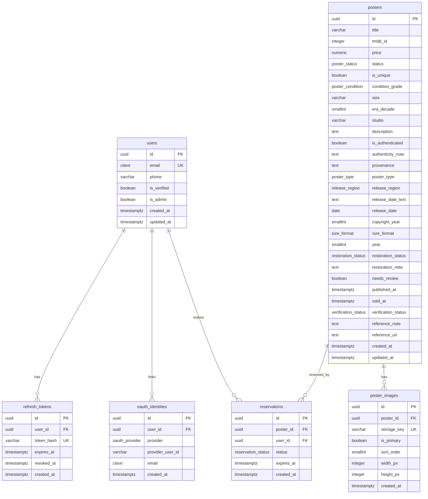

# Database Design — Poster Nung Backend (PostgreSQL)

> ขอบเขต: **Core F1–F3** (Authentication, Poster Catalog, Cart & Reservation)
> **+ ชั้น marketplace ทั้งชุด (INF-32 · 12 ตาราง · §4.8–§4.19)** ‹2026-08-26›
> โมเดล: 🔴 **ไม่ใช่ single-store อีกแล้ว — `ADR-0028` (2026-08-21) กลับมติ `ADR-0001`
> เป็น marketplace ผู้ขายหลายเจ้า** และ migration ลงจริงแล้ว 4 revision
> ‹ถ้อยคำเดิม *"Single-store MVP โดยเจตนา … ขยายเป็น multi-vendor ได้แบบ additive ในอนาคต"*
> เป็นเท็จตั้งแต่ 2026-08-21 — "อนาคต" ที่ §8 พูดถึงมาถึงแล้ว และมาแบบที่ §8.3 ไม่ได้ทำนายไว้ ดู §8.3›
> Deliverable: design doc + ERD (ยังไม่แตะ SQLAlchemy models)
> Source of truth: `CLAUDE.md` feature templates F1–F3
> PostgreSQL 16 (ตาม `docker-compose.yml`)

---

## 1. Overview

Backend REST API ของ e-commerce ขายโปสเตอร์หนังต้นฉบับ **ชิ้นเดียวในโลก (สต็อก=1)** ทำให้ schema ต้องรองรับ 2 ความเสี่ยงหลัก:

1. **Unique inventory** — 1 โปสเตอร์ = 1 ชิ้น ห้ามถูกจอง/ขายซ้อน → กันด้วย **row-lock (`FOR UPDATE`) + partial unique index** (2 ชั้น)
2. **ไม่มีข้อมูลบัตรดิบ** — 🔴 ‹แก้ 2026-08-26› **payment ไม่ได้อยู่นอก scope แล้ว** ตาราง
   `payments` · `payouts` ลงตั้งแต่ `e4d0f6021357` · สิ่งที่ยังจริงคือ **schema ต้องไม่มี field
   การเงินอ่อนไหว** และวันนี้ไม่มีจริง — `ADR-0029` ให้ MVP รับเงินด้วย **โอนเข้าบัญชีกลาง +
   อัปสลิป + แอดมินยืนยัน** จึงไม่มีเลขบัตรให้เก็บตั้งแต่ต้นทาง (Omise เลื่อนไป Phase 2)
   · **ด่านที่บังคับข้อนี้จริงคือ `tests/unit/test_no_card_data_in_schema.py` ไม่ใช่ `grep`** (ดู §9)

ตารางชั้น F1–F3: `users`, `refresh_tokens`, `oauth_identities`, `posters`, `poster_images`,
`reservations`, `poster_splits`, `poster_attribute_reviews`

**ตารางชั้น marketplace (INF-32 · `ADR-0028`)** — `seller_profiles` · `addresses` · `orders` ·
`order_shipping_details` · `order_status_history` · `payments` · `payouts` · `disputes` ·
`reviews` · `favorites` · `platform_settings` · `notification_outbox` (§4.8–§4.19)

🔴 **ไม่มีตาราง `order_items`** — `ADR-0020` **A4-D2** ย้าย 6 ฟิลด์ snapshot ขึ้นไปอยู่บน
`orders` ทั้งหมด เพราะออร์เดอร์หนึ่งใบ = โปสเตอร์หนึ่งใบเสมอ (สต็อก=1) · เอกสารเก่าที่
เขียนถึง `order_items` เป็นแผนที่ถูกกลับมติแล้ว

> **อัปเดต (migration `a7c4e91b2d38`):** ตาราง `otp_codes`, คอลัมน์ `users.hashed_password` และ enum `otp_purpose`
> **ถูก drop ออกแล้ว** — sign-in ทุกวิธี (email/password, phone-OTP, Google) ทำที่ Firebase ฝั่ง client
> backend แค่ verify ID token (ดู [`api-contract-f1-f3.md` §6](./api-contract-f1-f3.md)) ส่วนที่เกี่ยวกับ
> local password/OTP ด้านล่างเก็บไว้เป็นบันทึกการออกแบบเดิมเท่านั้น

---

## 2. Conventions (ใช้ทุกตาราง)

| หัวข้อ | มาตรฐาน |
|---|---|
| Primary key | `id UUID` default `gen_random_uuid()` (built-in ตั้งแต่ PG13 — ไม่ต้องพึ่ง extension) |
| Money | `NUMERIC(12,2)` + `CHECK (>= 0)` |
| Timestamp | `TIMESTAMPTZ` เสมอ (ไม่ใช้ naive `timestamp`); `created_at` / `updated_at` default `now()` |
| Foreign key | ระบุ `ON DELETE` ชัดเจน — `CASCADE` สำหรับ child ที่ตายตามได้, `RESTRICT` สำหรับ reference สำคัญ |
| Naming | table = พหูพจน์ snake_case, FK = `<parent>_id`, index = `ix_<table>_<cols>`, unique = `uq_<table>_<cols>` |

---

## 3. Enum Types

```sql
CREATE TYPE poster_status      AS ENUM ('available', 'reserved', 'sold');
CREATE TYPE reservation_status AS ENUM ('active', 'expired', 'converted');
CREATE TYPE otp_purpose        AS ENUM ('registration', 'login');
CREATE TYPE poster_condition   AS ENUM ('mint', 'near_mint', 'very_fine', 'fine', 'very_good', 'good', 'fair', 'poor');

-- ADR-0009 — คุณลักษณะเชิงพรรณนาของโปสเตอร์ (UPPERCASE, ต่างจาก 4 ตัวบนที่เป็น lowercase)
CREATE TYPE poster_type        AS ENUM ('TEASER', 'ADVANCE', 'THEATRICAL', 'RERELEASE', 'UNKNOWN');
CREATE TYPE release_region     AS ENUM ('TH', 'US', 'JP', 'UK', 'INTL', 'UNKNOWN');
CREATE TYPE size_format        AS ENUM ('ONE_SHEET', 'HALF_SHEET', 'INSERT', 'QUAD', 'OTHER', 'UNKNOWN');
CREATE TYPE restoration_status AS ENUM ('NONE', 'RESTORED', 'LINEN_BACKED', 'UNKNOWN');

-- ADR-0014 D21 — เปิดหาแหล่งอ้างอิงแล้วเจอหรือไม่ (ไม่ใช่การรับรองความแท้
-- และไม่ใช่การตัดสินว่าใบไหนต่างจากมาตรฐาน) · NULL = NOT_CHECKED
CREATE TYPE verification_status AS ENUM ('REFERENCE_FOUND', 'NO_REFERENCE_FOUND');

-- ══ ชั้น marketplace (INF-32 · ADR-0028 · migration b1a7c3d9e024 + d3c9e5f10246) ══
-- 🔴 poster_status ถูก ALTER เพิ่ม 4 ค่าใน revision แยก (INF-32 AC-4) — ค่าเดิม 3 ตัวไม่ถูกแตะ
--    ลำดับใน enum วันนี้: draft · pending_review · rejected · available · reserved · sold · delisted
--    ⚠️ ลบค่าออกจาก PG enum ไม่ได้ — ขั้นนี้ย้อนไม่ได้
CREATE TYPE poster_tier            AS ENUM ('ORIGINAL_VINTAGE', 'ORIGINAL_MODERN', 'REPRINT');
CREATE TYPE order_status           AS ENUM ('AWAITING_PAYMENT', 'PAYMENT_REVIEW', 'AWAITING_SHIPMENT',
                                            'SHIPPED', 'COMPLETED', 'CANCELLED', 'DISPUTED', 'REFUNDED');
CREATE TYPE payment_status         AS ENUM ('AWAITING', 'CLAIMED', 'VERIFIED', 'REJECTED');
CREATE TYPE payout_status          AS ENUM ('QUEUED', 'PAID', 'FAILED');
CREATE TYPE kyc_status             AS ENUM ('PENDING', 'APPROVED', 'REJECTED');
CREATE TYPE dispute_status         AS ENUM ('OPEN', 'RESOLVED_REFUND', 'RESOLVED_RELEASE', 'REJECTED');
CREATE TYPE delivery_confirm_actor AS ENUM ('BUYER', 'SYSTEM_AUTO', 'ADMIN');   -- ADR-0020 A4-D1
CREATE TYPE notification_channel   AS ENUM ('EMAIL', 'LINE');
CREATE TYPE notification_status    AS ENUM ('PENDING', 'SENT', 'FAILED');
```

> ⚠️ **ยืนยันสเกลก่อน finalize:** ค่าใน `poster_condition` ข้างบนอิงเกรดเชิงพรรณนาที่ใช้กันในวงการ (แนว Heritage Auctions) แต่ยังมีระบบตัวเลข **C1–C10** ที่นิยมเช่นกัน — ควรยืนยันมาตรฐานที่นักสะสมไทย/สากลยอมรับก่อนล็อค (ตรงกับ Open Question ใน PRD) ประเด็นหลักคือ **ต้องเป็น enum เดียวทั้งระบบ** ไม่ใช่ free-text (BR-03) เพื่อให้ marketplace ในอนาคตเทียบสภาพข้ามผู้ขายได้

| enum | ค่า | ใช้ที่ |
|---|---|---|
| `poster_status` | `available` · `reserved` · `sold` | `posters.status` |
| `reservation_status` | `active` · `expired` · `converted` | `reservations.status` |
| `poster_condition` | `mint` · `near_mint` · `very_fine` · `fine` · `very_good` · `good` · `fair` · `poor` | `posters.condition_grade` |
| `poster_type` | `TEASER` · `ADVANCE` · `THEATRICAL` · `RERELEASE` · `UNKNOWN` | `posters.poster_type` |
| `release_region` | `TH` · `US` · `JP` · `UK` · `INTL` · `UNKNOWN` | `posters.release_region` |
| `size_format` | `ONE_SHEET` · `HALF_SHEET` · `INSERT` · `QUAD` · `OTHER` · `UNKNOWN` | `posters.size_format` |
| `restoration_status` | `NONE` · `RESTORED` · `LINEN_BACKED` · `UNKNOWN` | `posters.restoration_status` |
| `verification_status` | `REFERENCE_FOUND` · `NO_REFERENCE_FOUND` | `posters.verification_status` |
| `poster_status` ‹ขยาย 2026-08-22› | +`draft` · `pending_review` · `rejected` · `delisted` (รวม 7 ค่า) | `posters.status` — เครื่อง listing ของ `ADR-0028` D4 |
| `poster_tier` | `ORIGINAL_VINTAGE` · `ORIGINAL_MODERN` · `REPRINT` | `posters.tier` — 🔴 **ไม่มี `UNKNOWN` โดยตั้งใจ** (BR-L3) |
| `order_status` | `AWAITING_PAYMENT` · `PAYMENT_REVIEW` · `AWAITING_SHIPMENT` · `SHIPPED` · `COMPLETED` · `CANCELLED` · `DISPUTED` · `REFUNDED` | `orders.status` — เครื่อง order |
| `payment_status` | `AWAITING` · `CLAIMED` · `VERIFIED` · `REJECTED` | `payments.status` |
| `payout_status` | `QUEUED` · `PAID` · `FAILED` | `payouts.status` |
| `kyc_status` | `PENDING` · `APPROVED` · `REJECTED` | `seller_profiles.kyc_status` |
| `dispute_status` | `OPEN` · `RESOLVED_REFUND` · `RESOLVED_RELEASE` · `REJECTED` | `disputes.status` |
| `delivery_confirm_actor` | `BUYER` · `SYSTEM_AUTO` · `ADMIN` | `orders.delivered_confirmed_by` (ADR-0020 A4-D1) |
| `notification_channel` | `EMAIL` · `LINE` | `notification_outbox.channel` |
| `notification_status` | `PENDING` · `SENT` · `FAILED` | `notification_outbox.status` |

> 🔴 **`NULL` ≠ `UNKNOWN` สำหรับ 4 enum ของ ADR-0009 และสำหรับ `verification_status`
> (ADR-0014 D3) ด้วย** — `NULL` = ยังไม่มีใครตรวจโปสเตอร์
> ใบนี้เลย (ค่าเริ่มต้นของทุกแถว) ส่วน `UNKNOWN` = **คนตรวจใบจริงแล้วแต่ตัดสินไม่ได้**
> เขียนได้เฉพาะคน ไม่ใช่ importer/สคริปต์/AI — เหตุผลเต็มดู ADR-0009 D2 อย่าเขียน query
> ที่ปฏิบัติสองค่านี้เหมือนกัน

> 🔴 **`poster_tier` เป็นข้อยกเว้นที่ต้องอ่านคู่กัน** — enum นี้ **ไม่มี `UNKNOWN`** เพราะ
> `BR-L3` สั่งว่าห้ามคลุมเครือ (ถ้าผู้ขายไม่รู้ว่าใบไหน = ยังไม่พร้อมขาย ไม่ใช่ต้องมีค่า
> ให้เลือกว่าไม่รู้) ⇒ บน `posters.tier` มีแค่ **`NULL` = ยังไม่มีใครกรอก** · สภาพ
> *"คนดูของจริงแล้วตัดสินไม่ได้"* **ไม่มีที่เก็บบนคอลัมน์นี้** — ที่เก็บอยู่ที่แถว
> `poster_attribute_reviews` (`field='tier'`, `value_after IS NULL`) ตามที่
> `ADR-0015` **Amendment 1 (A1-D2)** เสนอไว้ · 🟡 **ใบนั้นยัง `Proposed` ยังไม่ Accepted**

---

## 4. Tables

### 4.1 `users` — F1 Authentication

| column | type | constraint | หมายเหตุ |
|---|---|---|---|
| `id` | UUID | PK, default `gen_random_uuid()` | |
| `email` | CITEXT | UNIQUE, NULL | case-insensitive unique · NULL ได้สำหรับ phone-only user |
| `phone` | VARCHAR(20) | NULL | |
| `is_verified` | BOOLEAN | NOT NULL default `false` | ยืนยันตัวตนกับ Firebase แล้ว |
| `is_admin` | BOOLEAN | NOT NULL default `false` | **ที่เก็บสิทธิ์แอดมินเพียงที่เดียวของระบบ** (ADR-0031 D1 = A-1 · INF-35) · 🔴 **ห้ามเพิ่มคอลัมน์สิทธิ์ตัวที่สอง** (`is_moderator` ฯลฯ) — วันที่มีคนที่สองที่ไม่ควรทำได้ทุกอย่างที่เจ้าของทำได้ ให้ย้ายไปตาราง `admin_grants` ทั้งก้อน |
| `created_at` | TIMESTAMPTZ | NOT NULL default `now()` | |
| `updated_at` | TIMESTAMPTZ | NOT NULL default `now()` | |

- `email` ใช้ **CITEXT** เพื่อกันสมัครซ้ำแบบ `A@x.com` vs `a@x.com` (ต้องเปิด extension `citext`)
- ไม่มี field รหัสผ่านใดๆ แล้ว — credential อยู่ที่ Firebase ทั้งหมด
- `is_admin` บังคับใช้ที่ dependency `require_admin` (`app/api/deps.py`) ซึ่งผูกไว้ที่ระดับ `APIRouter` ของเส้นทาง `/admin` ไม่ใช่รายเส้น — เหตุผลและตารางกรณี fail-closed อยู่ที่ **ADR-0031** ห้ามเล่าซ้ำที่นี่
- Index: unique บน `email` (มาจาก UNIQUE โดยปริยาย)

---

### 4.2 `otp_codes` — F1 ⚠️ **ถูก drop แล้ว** (เก็บไว้เป็นบันทึกการออกแบบเดิม)

| column | type | constraint | หมายเหตุ |
|---|---|---|---|
| `id` | UUID | PK | |
| `user_id` | UUID | FK → `users(id)` ON DELETE CASCADE, NOT NULL | |
| `code_hash` | VARCHAR(255) | NOT NULL | hash ของ OTP ห้ามเก็บ/log ค่าดิบ |
| `purpose` | otp_purpose | NOT NULL default `'registration'` | |
| `expires_at` | TIMESTAMPTZ | NOT NULL | |
| `consumed_at` | TIMESTAMPTZ | NULL | เวลาที่ใช้ OTP สำเร็จ |
| `attempt_count` | SMALLINT | NOT NULL default `0` | นับครั้งกรอกผิดของ code นี้ |
| `created_at` | TIMESTAMPTZ | NOT NULL default `now()` | |

- **เก็บ `code_hash` ไม่เก็บ OTP ดิบ** (ปฏิบัติเดียวกับ password) — สอดคล้องกฎ "ห้าม log payment token/password"
- **Lockout กัน brute-force (OWASP: Broken Authentication):** OTP 6 หลักมีแค่ 1,000,000 คอมโบ ต้องล็อกเมื่อกรอกผิดเกิน threshold ที่ service layer — เมื่อ `attempt_count >= 5` สำหรับ code เดียว → invalidate code นั้น (บังคับขอใหม่) และคืน 429 ห้ามปล่อยให้เดาไม่จำกัด
- **Rate-limit** ทำที่ service layer โดยนับ row ใน window:
  ```sql
  SELECT count(*) FROM otp_codes
  WHERE user_id = :user_id AND created_at > now() - interval '10 minutes';
  -- ถ้า >= 5 → block (429)
  ```
- Index: `ix_otp_codes_user_created (user_id, created_at DESC)`

---

### 4.3 `refresh_tokens` — F1 (*optional แต่แนะนำ*)

| column | type | constraint | หมายเหตุ |
|---|---|---|---|
| `id` | UUID | PK | |
| `user_id` | UUID | FK → `users(id)` ON DELETE CASCADE, NOT NULL | |
| `token_hash` | VARCHAR(255) | UNIQUE, NOT NULL | hash ของ refresh token |
| `expires_at` | TIMESTAMPTZ | NOT NULL | |
| `revoked_at` | TIMESTAMPTZ | NULL | ตั้งค่าเมื่อ logout/revoke |
| `created_at` | TIMESTAMPTZ | NOT NULL default `now()` | |

- ต้องการ logout/revoke ฝั่ง server → เก็บ hash ของ refresh token ที่นี่
- ถ้าเลือก JWT refresh แบบ stateless ล้วน ตารางนี้ตัดออกได้
- Index: `ix_refresh_tokens_user (user_id)`

---

### 4.4 `posters` — F2 Catalog + Detail

| column | type | constraint | หมายเหตุ |
|---|---|---|---|
| `id` | UUID | PK | |
| `title` | VARCHAR(255) | NOT NULL | |
| `tmdb_id` | INTEGER | NULL | **canonical movie id (TMDB)** — เผื่ออนาคตจัดกลุ่มหลาย edition ใต้หนังเรื่องเดียว (ดู §8) |
| `price` | NUMERIC(12,2) | NOT NULL, CHECK (`price >= 0`) | THB |
| `status` | poster_status | NOT NULL default `'available'` | |
| `is_unique` | BOOLEAN | NOT NULL default `true` | สต็อก=1 (MVP รองรับเฉพาะ unique — ดูหมายเหตุ) |
| `condition_grade` | poster_condition | NULL | enum มาตรฐาน (BR-03) ไม่ใช่ free-text |
| `size` | VARCHAR(50) | NULL | เช่น "27x40 in" (one-sheet) |
| `era_decade` | SMALLINT | NULL | เช่น `1980` |
| `studio` | VARCHAR(100) | NULL | |
| `description` | TEXT | NULL | |
| `is_authenticated` | BOOLEAN | NOT NULL default `false` | 🔴 **เลิกใช้แล้ว (ADR-0014 D4)** — ใช้ `verification_status` แทน · ยังส่งออก API พร้อม `deprecated: true` จนกว่าจะถูก drop ใน INF-14 · ห้าม derive ค่านี้จาก `verification_status` |
| `authenticity_note` | TEXT | NULL | ใบรับรอง/certificate ref (spec 1.5) |
| `provenance` | TEXT | NULL | ประวัติที่มา (spec 1.5) |
| `poster_type` | poster_type | NULL | ชนิดของใบ (teaser/advance/…) — NULL = ยังไม่มีใครตรวจ (ADR-0009 D1/D2) |
| `release_region` | release_region | NULL | ภูมิภาคที่ใบนี้ออกเพื่อการฉาย — **ไม่ใช่** ภูมิภาคที่พิมพ์ (ADR-0009 D7) |
| `release_date_text` | TEXT | NULL | ข้อความวันฉาย *ตามที่พิมพ์บนใบ* (observed) ไม่ตีความ ไม่ normalize — ADR-0009 D13 (amendment), migration `8ed5607ab0f5` · แปลงเป็น `release_date` ด้วย `app.core.release_date.parse_release_date_text` |
| `release_date` | DATE | NULL | วันฉายที่ *พิมพ์อยู่บนตัวใบ* ไม่ใช่วันฉายจริงตามประวัติศาสตร์ (ADR-0009 D3) |
| `copyright_year` | SMALLINT | NULL | ปีใน billing block ของตัวใบ — คนละอย่างกับ `year` และ `release_date` (ADR-0009 D3) |
| `size_format` | size_format | NULL | map จากขนาดที่ยืนยันแล้วเท่านั้น ห้ามอนุมานจากรูป (ADR-0009 D4) |
| `year` | SMALLINT | NULL | ปีที่หนังฉาย — คนละอย่างกับ `era_decade` (ทศวรรษ) (ADR-0009 D3) |
| `restoration_status` | restoration_status | NULL | ยุบสองแกน (บูรณะ/mount) เป็นแกนเดียว — รายละเอียดดู ADR-0009 D5 |
| `restoration_note` | TEXT | NULL | อธิบายเพิ่มเมื่อ `restoration_status` ไม่พอ (เช่นทั้งบูรณะและ mount) |
| `needs_review` | BOOLEAN | NOT NULL default `true` | 🔴 **ธงงานภายใน ไม่ออก public API เลย** (ADR-0009 D11) — `true` = ยังไม่มีคนยืนยันข้อมูล 9 คอลัมน์ของ ADR-0009 ของแถวนี้ |
| `published_at` | TIMESTAMPTZ | NULL, CHECK (`ck_posters_published_requires_condition_grade`, `ck_posters_published_requires_verified`) | 🔴 **ธงงานภายใน ไม่ออก public API เลย** (ADR-0013 D5) — "ตั้งวางบนชั้นให้ลูกค้าเห็นตั้งแต่เมื่อไหร่" · `NULL` = ยังไม่เปิดขาย **ไม่มี** `server_default` (D1) |
| `verified_at` | TIMESTAMPTZ | NULL, CHECK (`ck_posters_published_requires_verified`) | 🔴 **ธงงานภายใน ไม่ออก public API เลย** (ADR-0027 D10 · precedent ADR-0013 D5) — เวลาที่ **คน** หยิบใบจริงขึ้นมาตรวจครบทุกมิติแล้วเซ็นรับ (ADR-0027 D1/D2/D3) · `NULL` = ยังไม่เคยมีใครตรวจใบนี้ **ไม่ใช่** "ตรวจแล้วไม่ผ่าน" (ไม่มีสถานะหลัง) · **ไม่มี** `server_default` (แนวเดียวกับ `published_at`/`sold_at`) · writer เดียวคือเส้นที่ 5 (`correction_entry.py` — `SIGN`) |
| `sold_at` | TIMESTAMPTZ | NULL, CHECK (`ck_posters_sold_requires_sold_at`) | เวลาที่ **คนตัดสินว่าขายไปแล้ว** ไม่ใช่เวลาที่สคริปต์รัน (ADR-0025 D4) — writer เดียวคือ `poster_service.mark_sold()` ซึ่งเขียนพร้อม `status` ในทรานแซกชันเดียว (D1) · `NULL` = ยังไม่ถูกขาย **ไม่มี** `server_default` และ**ไม่ backfill** (D2 · AC-8) · 🔴 ต่างจาก `published_at`/`needs_review` ตรงที่ฟิลด์นี้**ออก public API** (`PosterDetailResponse` เท่านั้น — ADR-0013 Amendment A-D3) เพราะเป็นข้อเท็จจริงของสินค้า (คู่กับ `price`) ไม่ใช่ธง ops |
| `verification_status` | verification_status | NULL | **derive จาก `reference_url`/`reference_note` เท่านั้น ห้ามกรอกด้วยมือ** (ADR-0014 D22) — ไม่ใช่การรับรองความแท้ (D1) · `NULL` = `NOT_CHECKED` ยังไม่มีใครเปิดหา (D21) · ออก public API |
| `reference_note` | TEXT | NULL | **เหตุผลตอนหาไม่เจอ อย่างเดียว** (ADR-0014 D22) — มีค่าพร้อม `reference_url` ไม่ได้ · ‹เดิมชื่อ `verification_note` · migration `f4c8a1e07b93`› · ออก public API |
| `reference_url` | TEXT | NULL | ลิงก์แหล่งอ้างอิงที่เปิดดูแล้วเจอ · มีค่า = `REFERENCE_FOUND` (D22) — **ยังไม่ออก public API ในรอบนี้** · D24 ปลดด่านสิทธิ์ของ OD-3/D6 แล้ว ที่เหลือคือยังไม่มีใครกรอกค่าสักแถว (writer คือ INF-13) |
| `created_at` | TIMESTAMPTZ | NOT NULL default `now()` | |
| `updated_at` | TIMESTAMPTZ | NOT NULL default `now()` | |

- **Index หลัก (F2 acceptance):** `ix_posters_status_era_price (status, era_decade, price)` รองรับ filter `in_stock_only` + `era` + `price range`
- 🔴 **`published_at` เป็นแกนที่สอง แยกจาก `status` (ADR-0013 D1, migration `d1a7c9e04b62`):** `status` = วงจรสต็อก (`available → reserved → sold`) · `published_at` = ความพร้อมขาย · สองแกนตั้งฉากกัน ใบที่ `sold` แล้วต้อง **ไม่** ถูกล้าง `published_at` (D6 — ไม่งั้น SCR-05 AC-5 พัง) · หน้าร้าน (list + `total` + detail) กรองด้วย `published_at IS NOT NULL` **ตัวเดียว** ไม่ซ้อนกับเงื่อนไขเกรด (D2 — `poster_repository.published_only()`) · **ยังไม่มี writer เลย** โดยตั้งใจ (D4) เส้นทางเปิดขายเป็นงาน INF-11
- **CHECK `ck_posters_published_requires_condition_grade`** = `published_at IS NULL OR condition_grade IS NOT NULL` — บังคับ BR-05 (ราคาต้องแสดงคู่สภาพ) ที่ระดับ DB ครอบทั้ง INSERT และ UPDATE เพราะ `scripts/seed/seed_posters.py` เขียนเข้าตารางตรง ๆ ไม่ผ่าน service (ADR-0013 D3) · ประกาศทั้งใน migration และ `Poster.__table_args__`
- 🔴 **CHECK `ck_posters_published_requires_verified`** = `published_at IS NULL OR verified_at IS NOT NULL OR status = 'sold'` — บังคับ invariant *"หน้าร้านแสดงเฉพาะแถวที่ผ่านการตรวจแล้ว"* (ADR-0027 D1) ที่ระดับ DB ครอบทั้ง INSERT และ UPDATE ด้วยเหตุผลเดียวกับตัวข้างบนทุกตัวอักษร (`scripts/seed/*.py` เขียนตรง ไม่ผ่าน service) · **ข้อยกเว้น `status = 'sold'`** มาจาก Amendment 3 (`A3-D1`, migration `07b34457489c`, INF-38) — `D4` ฉบับเดิมเขียน SQL ไม่มีข้อยกเว้นนี้ไว้ แต่ **เดินไม่ได้จริง** เพราะขัดกับ `A-D11` (ห้ามถอนใบ `sold` ทุกกรณี) เอง: มีใบที่ `sold` ไปแล้วก่อนมีใครเซ็น `verified_at` และเซ็นย้อนหลังไม่ได้อีก (ของที่ขายแล้วไม่มีใครหยิบขึ้นมาตรวจ — `A3-D2` ห้ามเซ็นย้อนหลังตรง ๆ) · ประกาศทั้งใน migration และ `Poster.__table_args__` · เทสล็อกไว้ที่ `tests/unit/test_poster_verified_constraint.py` (constraint ตรง ๆ) และ `tests/unit/test_publish_predicate_agreement.py` (ล็อกความสัมพันธ์กับ `poster_service.is_publishable()` — คู่ Python↔SQL)
- 🔴 **`sold_at` เป็นแกนที่สาม (ADR-0025 D1/D2, migration `760b692b6062`, INF-24):** `status` ตอบ *"ซื้อได้ไหม"* · `published_at` ตอบ *"อยู่บนร้านไหม"* · `sold_at` ตอบ *"ขายเมื่อไหร่"* — คำถามที่สองไม่มีสิทธิ์ตอบคำถามแรกแทน (ADR-0013 Amendment A-D1) `poster_service.mark_sold()` เป็น **writer เดียวของ `posters.status`** ในทั้งระบบ เขียน `status=sold` + `sold_at` พร้อมกันเสมอในทรานแซกชันเดียว หลังล็อก `FOR UPDATE` แล้วตรวจว่าไม่มี reservation ที่ยัง `active` (ปฏิเสธทั้งรายการถ้ามี — ไม่มี `--force`) และ `status` เดิมต้องเป็น `available` เท่านั้น
- **CHECK `ck_posters_sold_requires_sold_at`** = `status <> 'sold' OR sold_at IS NOT NULL` — บังคับว่าไม่มีทางได้แถวที่ `sold` แต่ไม่รู้ว่าเมื่อไหร่ (ADR-0025 D2 — เหตุผลเดียวกับ `ck_posters_published_requires_condition_grade` ทุกตัวอักษร) ครอบทั้ง INSERT และ UPDATE เพราะ `scripts/seed/seed_posters.py --status sold` เขียนเข้าตารางตรง ๆ ไม่ผ่าน service เช่นกัน · ประกาศทั้งใน migration และ `Poster.__table_args__` · ทางเรียกวันนี้คือ CLI ของ operator เท่านั้น (`scripts/seed/sold_entry.py` — ไม่มี endpoint จนกว่าจะมี admin auth)
- 🔴 **`verification_*` + `reference_url` (ADR-0014, migration `4f0b6c2ad713`):** ทั้งสามตัว nullable **ไม่มี** `server_default` และ **ไม่ backfill** — ไม่ผูกกับ `published_at` ไม่มี CHECK ไม่มี index (D8) · **รอบนี้ไม่มี writer เลยโดยตั้งใจ** (D7) ทุกแถวเป็น NULL จนกว่า INF-13 จะเสร็จ · importer/`apply_suggestions.py`/AI **ห้ามเขียนตลอดกาล** (เทสล็อกไว้ที่ `tests/unit/test_seed_importer_omits_unverified_adr0009_fields.py`) · `PosterDetailResponse` ส่งออก 2 ใน 3 ตัว (`reference_url` รอ OD-3)
- ฟิลด์ `authenticity_note` / `provenance` รองรับหน้า detail (UXPilot 1.5) · `is_authenticated` เคยอยู่ในกลุ่มนี้แต่ **เลิกใช้แล้วตาม ADR-0014 D4** (ลบใน INF-14)
- **`tmdb_id` (future-proofing):** เริ่มเก็บ canonical movie id ตั้งแต่ MVP แม้ single-store ยังไม่ได้ใช้จัดกลุ่ม — ต้นทุนแทบเป็นศูนย์ แต่ช่วยให้ตอนขยายเป็น marketplace ไม่ต้องมานั่ง reconcile `title` แบบ free-text ย้อนหลัง (เช่น "Blade Runner" vs "เบลดรันเนอร์") เพิ่ม `ix_posters_tmdb (tmdb_id)` เมื่อเริ่มใช้งานจริง
- **`condition_grade` เป็น enum:** ใช้ `poster_condition` เพื่อ data quality + รองรับ filter/เทียบข้ามผู้ขายในอนาคต (BR-03)
- **ขอบเขต `is_unique` (MVP):** โมเดล reservation ทั้งหมด (`available→reserved→sold`) ออกแบบมาเพื่อ **ของชิ้นเดียว** เท่านั้น รอบนี้ **commit ว่าทุกโปสเตอร์ unique** (`is_unique = true` เสมอ) — คอลัมน์นี้สงวนไว้เป็น flag สำหรับอนาคตหากจะรองรับสินค้าหลายชิ้น (ซึ่งต้องเพิ่ม stock model + แก้ reservation logic แยกต่างหาก)
  - 🔴 **stock model ตัวนั้นมีแล้ว: `../workspace/docs/adr/ADR-0019` (Accepted 2026-08-09)** — และคำตอบคือ **ยังไม่เพิ่มคอลัมน์ `quantity`** · ประโยคข้างบนยังจริง **แต่ข้อมูลยังไม่ตรงกับมัน**: `is_unique = false` **33 แถว** (ADR-0019 §ข้อเท็จจริง) · ประตูเดียวที่ยอมให้แถวแทนของหลายชิ้นคือเกรด `mint` (D1) ซึ่งวันนี้ **ไม่มีสักใบในตาราง** ⇒ ทุกแถวต้องลงเอยที่ 1 แถว 1 ชิ้น
  - 🔴 **ห้ามเขียน `is_unique` ด้วย `UPDATE` ตรง หรือด้วย `--allow-overwrite`** — ADR-0019 **D12** จัดฟิลด์นี้ไว้ชั้นเดียวกับ `condition_grade` คือแก้ได้เฉพาะผ่าน *เส้นทางที่มีคนรู้เห็น* ซึ่ง**ยังไม่มีอยู่จริง** (รอ ADR-0010 Amendment + INF) · `manual_entry.py` วันนี้เขียนฟิลด์นี้ไม่ได้เลยโดยตั้งใจ
  - **การรื้อ `uq_active_reservation_per_poster` (§4.6) เป็นเงื่อนไขบังคับของวันที่จะรองรับหลายชิ้นจริง** — index นั้นปฏิเสธ active reservation ที่สองของแถวเดียวกันที่ระดับ DB ⇒ แถวที่แทน 3 ชิ้นจะขายได้ทีละคนเท่านั้น (ADR-0019 D5) · ต้องทำพร้อมคอลัมน์ + BR-04 ทั้ง 5 จุดในรอบเดียว ห้ามทยอย
- **คอลัมน์ของ ADR-0009 (migration `97a20572ba79` 9 ตัว + `8ed5607ab0f5` อีก 1 ตัว = 10):** เพิ่มลง `posters` อย่างเดียว ไม่มีตารางใหม่ · ทุกคอลัมน์ nullable **ไม่มี** `server_default` ยกเว้น `needs_review` (เหตุผลของข้อยกเว้นนี้ดู ADR-0009 D2 กับ Alternative 7) · `PosterDetailResponse` ส่งออก 9 ใน 10 ตัวนี้ (ทุกตัวยกเว้น `needs_review`) — ไม่มีตัวไหนอยู่ใน `PosterListItem` · ตัวที่ 10 คือ `release_date_text` ซึ่งมาทีหลังจาก D13 amendment ไม่ได้อยู่ในชุดแรก

---

**คอลัมน์ที่ marketplace เพิ่มเข้ามา (INF-32 · migration `c2b8d4e0f135` + `d3c9e5f10246`)**

| column | type | constraint | หมายเหตุ |
|---|---|---|---|
| `seller_id` | UUID | FK → `seller_profiles(id)`, **NOT NULL** | ของเดิม 113 แถว backfill เป็น **house account** แล้วจึง `SET NOT NULL` (`ADR-0028` **D3**) — ของร้านเราเองไม่ใช่ข้อยกเว้นของโมเดล มันคือผู้ขายรายหนึ่ง |
| `tier` | `poster_tier` | nullable | `BR-L3` · 🔴 **`NULL` ทั้ง 113 แถวโดยตั้งใจ** (Q2 ของ proposal §6 — ข้อเท็จจริงที่มีแต่เจ้าของรู้) · **ห้าม backfill เดาเอง** · ทางเติมค่าคือเส้นที่ 3 ตาม `ADR-0015` Amendment 1 (ยัง `Proposed`) |
| `shipping_fee` | NUMERIC(12,2) | NOT NULL | ค่าส่งต่อใบที่ผู้ขายตั้ง — snapshot ลง `orders.shipping_fee` ตอนสร้างออร์เดอร์ |
| `approved_at` | TIMESTAMPTZ | nullable | เวลาที่แอดมินอนุมัติ listing |
| `approved_by` | UUID | FK → `users(id)` | ใครอนุมัติ |
| `rejection_reason` | TEXT | nullable | เหตุผลตอนปฏิเสธ (`status = rejected`) |

🔴 **CHECK `ck_posters_sellable_requires_approved_at`** — สถานะที่ขายได้
(`available` · `reserved` · `sold`) **ต้องมี `approved_at`** (`BR-L6`) ⇒ ของที่ยังไม่ผ่าน
แอดมินขึ้นร้านไม่ได้ที่ระดับ DB ไม่ใช่แค่ที่โค้ด

---


### 4.5 `poster_images` — F2 (รูปหลายรูปต่อโปสเตอร์)

> **ADR-0006** (2026-08-01): เปลี่ยนจากเก็บ `url` เต็มเป็นเก็บ `storage_key` (object key
> สัมพันธ์กับ bucket) แล้วประกอบ URL ที่ชั้น service ผ่าน `app.core.media.build_media_url`
> (`settings.MEDIA_BASE_URL` + key) เหตุผล: URL เต็มผูกโฮสต์/path/วิธีเข้าถึงไว้ค่าเดียว
> ทำให้ก๊อปข้าม env ไม่ได้, ย้าย CDN ต้อง UPDATE ทุกแถว, ทำ signed URL ไม่ได้ — migration
> เดียวเพราะตารางว่างทุก env ตอนทำ ไม่มี backfill

| column | type | constraint | หมายเหตุ |
|---|---|---|---|
| `id` | UUID | PK | |
| `poster_id` | UUID | FK → `posters(id)` ON DELETE CASCADE, NOT NULL | |
| `storage_key` | VARCHAR(512) | NOT NULL, UNIQUE (`uq_poster_images_storage_key`) | object key ของรูป — path มี segment `visibility` (`public`/`internal`) กำกับสิทธิ์การเข้าถึง (`internal` ยังไม่ใช้ในรอบนี้) รูปแบบเต็มและกฎ charset ดู ADR-0006 D2 |
| `is_primary` | BOOLEAN | NOT NULL default `false` | รูปปก |
| `sort_order` | SMALLINT | NOT NULL default `0` | |
| `width_px` | INTEGER | NULL, CHECK `ck_poster_images_dimensions_positive`/`_paired` | pixel ของ object ต้นฉบับ — `Integer` ไม่ใช่ `SmallInteger` (สแกน 1200dpi ล้น 32767); nullable เพราะยังไม่มี endpoint upload ที่เติมค่าอัตโนมัติ (BLOCK 5.1); ไม่ออก API รอบนี้ |
| `height_px` | INTEGER | NULL, CHECK เดียวกับ `width_px` | ต้อง NULL คู่กับ `width_px` เสมอ (รู้ด้านเดียวคำนวณ aspect ratio ไม่ได้) |
| `created_at` | TIMESTAMPTZ | NOT NULL default `now()` | |

- Index: `ix_poster_images_poster (poster_id, sort_order)`
- กันรูป primary ซ้ำ: `CREATE UNIQUE INDEX uq_poster_images_primary ON poster_images (poster_id) WHERE is_primary;`
- CHECK `ck_poster_images_dimensions_positive` และ `ck_poster_images_dimensions_paired` —
  นิยามเต็มดู ADR-0006 D4

---

### 4.6 `reservations` — F3 ⚠️ จุดวิกฤต

| column | type | constraint | หมายเหตุ |
|---|---|---|---|
| `id` | UUID | PK | |
| `poster_id` | UUID | FK → `posters(id)` ON DELETE RESTRICT, NOT NULL | |
| `user_id` | UUID | FK → `users(id)` ON DELETE CASCADE, NOT NULL | |
| `status` | reservation_status | NOT NULL default `'active'` | |
| `expires_at` | TIMESTAMPTZ | NOT NULL | = `created_at + interval '15 min'` |
| `created_at` | TIMESTAMPTZ | NOT NULL default `now()` | |

- **Constraint สำคัญที่สุด — กัน 1 โปสเตอร์ถูกจองซ้อน (defense ระดับ DB):**
  ```sql
  CREATE UNIQUE INDEX uq_active_reservation_per_poster
    ON reservations (poster_id) WHERE status = 'active';
  ```
  → active reservation ได้ **ตัวเดียวต่อโปสเตอร์** แม้ app logic พลาดก็ยังกันได้
- Index: `ix_reservations_status_expires (status, expires_at)` สำหรับ scheduler `release_expired()`

### 4.7 `poster_splits` — INF-22/INF-25 (ร่องรอยการแตกแถว, ADR-0024 D2 · A-D5)

🔴 **คีย์กันรันซ้ำย้ายจาก `(parent_poster_id, reason)` ไป `(parent_poster_id, piece_no)`
เมื่อ 2026-08-15 (ADR-0024 A-D5 · INF-25)** — `reason` ผูกด่านไว้กับข้อความที่ workflow
จริงบังคับให้เปลี่ยนทุกรอบ (~4 รอบต่อพ่อหนึ่งคน) ทำให้แก้คำผิดใน `reason` แล้วรันไฟล์
เดิมซ้ำสร้างลูกเกินมาได้โดยไม่มีอะไรฟ้อง (`screens.yaml` INF-22 G2)

| column | type | constraint | หมายเหตุ |
|---|---|---|---|
| `id` | UUID | PK | |
| `child_poster_id` | UUID | FK → `posters(id)` ON DELETE CASCADE, NOT NULL, **UNIQUE** (`uq_poster_splits_child_poster`) | แถวลูกที่ถูกสร้างจากการแตกครั้งนี้ — UNIQUE กัน insert ผิดพลาดที่ชี้ child ซ้ำ (แทบเป็นไปไม่ได้เพราะ id เป็น `uuid4()` สดใหม่ทุกแถว) 🔴 **ไม่ใช่ด่านกันรันซ้ำ** — ดูคอลัมน์ `piece_no` |
| `parent_poster_id` | UUID | FK → `posters(id)` ON DELETE CASCADE, NOT NULL | แถวพ่อที่ถูกแตกออกมา (ไม่ unique เดี่ยว ๆ — พ่อแตกได้หลายรอบ) · คู่กับ `piece_no` เป็น **`uq_poster_splits_parent_piece`** — ด่านจริงที่กันรันใบงานเดิมซ้ำที่ระดับ DB |
| `piece_no` | INTEGER | NOT NULL, **CHECK `piece_no >= 2`** (`ck_poster_splits_piece_no_min`), **UNIQUE ร่วมกับ `parent_poster_id`** (`uq_poster_splits_parent_piece`) | "ชิ้นที่เท่าไหร่ของพ่อคนนี้" — เริ่มที่ 2 เพราะแถวพ่อเองคือชิ้นที่ 1 (ADR-0019 D1) 🔴 **ไม่มี `server_default`** เพราะการนับอัตโนมัติ = รันซ้ำได้เลขใหม่ = ด่านกันรันซ้ำไม่กันอะไรเลย — `make_split_sheet.py` (generator) อ่าน `max(piece_no)+1` ต่อพ่อจาก DB มาเติมในใบงาน · `split_entry.py` (applier) **เขียนค่าที่มาจากไฟล์เท่านั้น ห้ามคำนวณเอง** |
| `reviewed_by` | VARCHAR(120) | NOT NULL | ชื่อคนตัดสินใจแตก — ข้อความที่พิมพ์เอง ไม่ผ่าน auth (ข้อจำกัดเดียวกับ `poster_attribute_reviews`) |
| `reviewed_at` | TIMESTAMPTZ | NOT NULL | เวลาที่คนตัดสินใจ — คนละอันกับ `created_at` |
| `source` | VARCHAR(255) | NOT NULL | ชื่อไฟล์ใบงาน (`split-entry.csv`) — CSV ไม่ commit เข้า repo |
| `reason` | TEXT | NOT NULL | เหตุผลที่แตกแถวนี้ — บังคับกรอกทุกแถว (ต่างจาก `poster_attribute_reviews.reason` ที่ nullable) 🔴 **ไม่อยู่ในคีย์หรือ index ใดอีกแล้ว** (เดิมเคยคู่กับ `parent_poster_id` เป็น `uq_poster_splits_parent_reason` — ถอดออกที่ A-D5) กลับไปทำหน้าที่เดียวคือบันทึกเหตุผล |
| `created_at` | TIMESTAMPTZ | NOT NULL default `now()` | = เวลาที่แตกจริง |

Index: `ix_poster_splits_parent (parent_poster_id)` — ค้นว่าพ่อแถวหนึ่งถูกแตกไปกี่ลูกแล้ว

**ทำไมเป็นตารางแยกไม่ใช่คอลัมน์ self-FK บน `posters`** — precedent เดียวกับ
`poster_attribute_reviews` (ฟิลด์ ops ตัวที่สองของ `posters` ควรแยกตาราง) +
`posters` ถูก query ตรงเพื่อ public response (self-FK จะหลุดออกไปกับ `select *` ได้
ง่ายกว่าตารางแยก) — เหตุผลเต็มอยู่ที่ `../workspace/docs/adr/ADR-0024-row-split-provenance-and-count-gates.md` D2

⚠️ **ตารางนี้ไม่มี endpoint ไหนอ่านเลย** — เป็นข้อมูลภายในล้วน ๆ ตาม ADR-0024 D6
(ไม่แตะ `docs/api/openapi.yaml`) · การแตกแถวสร้างแถวลูกใหม่ใน `posters` (INSERT
ธรรมดา ไม่มีคอลัมน์พิเศษ) — `child_poster_id` ชี้แถวนั้น

---

### 4.8 `seller_profiles` — INF-32 (ผู้ขาย · KYC · บัญชีรับเงิน · ADR-0028 D3)

| column | type | constraint | หมายเหตุ |
|---|---|---|---|
| `id` | UUID | PK | **ไม่ใช่ `users.id`** — สอง id นี้คนละตัว (ดูกล่องแดงท้าย §4.10) |
| `user_id` | UUID | FK → `users(id)` CASCADE, **UNIQUE** (`uq_seller_profiles_user_id`) | หนึ่ง user = ผู้ขายได้ไม่เกินหนึ่งราย |
| `display_name` · `real_name` | VARCHAR | NOT NULL | ชื่อร้าน / ชื่อจริง |
| `phone_verified_at` | TIMESTAMPTZ | nullable | |
| `bank_name` · `bank_account_name` · `bank_account_no` | VARCHAR | NOT NULL | 🔴 **`bank_account_no` เก็บ plaintext โดยตั้งใจ** (`ADR-0028` **A1-D2**) — DB ไม่เปิด public + **ไม่ออก API เลย** · การเข้ารหัสระดับคอลัมน์แลกมาด้วย key management ที่คนเดียวดูแลไม่ไหว · **ด่านตัวจริงคือเทสเชิงลบว่าไม่หลุด public API** (`SCR-12` AC-2) |
| `id_card_image_key` | TEXT | nullable | คีย์ใน object storage ไม่ใช่ตัวไฟล์ |
| `kyc_status` | `kyc_status` | NOT NULL df `PENDING` | + `kyc_reviewed_at` · `kyc_reviewed_by` · `kyc_rejection_reason` |
| `commission_rate_bps` | INTEGER | nullable · CHECK `0..10000` | **`NULL` = ใช้ค่ากลางจาก `platform_settings`** ไม่ใช่ "ไม่หักคอม" |
| `is_house_account` | BOOLEAN | NOT NULL df `false` | ของร้านเราเอง — **ข้ามคิดคอมและข้ามคิว payout** (proposal §6 Q3) |

🔴 **CHECK `ck_seller_profiles_rejected_requires_reason`** — ปฏิเสธ KYC โดยไม่บอกเหตุผลไม่ได้

---

### 4.9 `addresses` — INF-32 (ที่อยู่ของผู้ซื้อ)

`id` PK · `user_id` FK → `users` CASCADE · `recipient_name` · `recipient_phone` ·
`address_line` · `sub_district` / `district` (nullable) · `province` · `postal_code` ·
`is_default` (NOT NULL df `false`) · `created_at`

⚠️ **ที่อยู่ของออร์เดอร์ไม่ได้อ้าง FK มาที่ตารางนี้** — มัน **คัดลอก** ไปไว้ที่
`order_shipping_details` ตอนสร้างออร์เดอร์ (§4.11) เพราะผู้ซื้อแก้ที่อยู่ทีหลังแล้ว
หลักฐานของออร์เดอร์เก่าต้องไม่เปลี่ยนตาม

---

### 4.10 `orders` — INF-32 ⚠️ ตารางกลางของเส้นทางซื้อขาย (ADR-0020 · ADR-0028 D4)

| column | type | constraint | หมายเหตุ |
|---|---|---|---|
| `id` | UUID | PK | |
| `order_no` | VARCHAR | **UNIQUE** (`uq_orders_order_no`) | `PN-YYMMDD-NNNN` เลขรันต่อวัน (proposal §6 Q6) · สร้างใต้ `pg_advisory_xact_lock` ของวันนั้น และ **ใช้วันที่ `Asia/Bangkok` ไม่ใช่ UTC** (`ADR-0033` **D6**) |
| `poster_id` | UUID | FK → `posters` **RESTRICT** | ของที่ซื้อ |
| `buyer_id` | UUID | FK → **`users(id)`** RESTRICT | |
| `seller_id` | UUID | FK → **`seller_profiles(id)`** RESTRICT | 🔴 อ่านกล่องแดงท้ายหัวข้อนี้ |
| `reservation_id` | UUID | FK → `reservations` RESTRICT, nullable | การจองที่แปลงเป็นออร์เดอร์ |
| `status` | `order_status` | NOT NULL df `AWAITING_PAYMENT` | เปลี่ยนได้ทางเดียวคือ **ประตูเดียว** ของ `ADR-0033` |
| `item_price` · `shipping_fee` · `total_amount` | NUMERIC(12,2) | CHECK `>= 0` · **CHECK `total = item + shipping`** | |
| `commission_rate_bps` · `commission_amount` · `seller_payout_amount` | INTEGER / NUMERIC | **CHECK `seller_payout_amount = total_amount - commission_amount`** | อัตราคอม **snapshot ตอนสร้าง** ไม่อ่านสดจาก `platform_settings` (BR-L7) |
| `item_title` · `item_condition_grade` · `item_image_urls` · `item_verification_status` · `item_reference_note` | — | — | **6 ฟิลด์ snapshot ที่ `ADR-0020` A4-D2 ย้ายขึ้นมาจาก `order_items` ไม่ลดสักฟิลด์** — หลักฐาน dispute ที่แก้ย้อนหลังไม่ได้ |
| `carrier` · `tracking_no` · `shipped_at` | — | nullable | |
| `ship_by_due_at` · `auto_confirm_due_at` | TIMESTAMPTZ | nullable | **snapshot ห้ามคำนวณสด** (`ADR-0032` D7) — ตัวคำนวณวันทำการอยู่ที่ `app/core/business_days.py` ที่เดียว |
| `delivered_at` · `delivered_confirmed_by` | TIMESTAMPTZ / `delivery_confirm_actor` | **CHECK ว่าง/ไม่ว่างพร้อมกัน** | 3 actor ตาม `ADR-0020` **A4-D1** |
| `shipping_purged_at` | TIMESTAMPTZ | nullable | มีตั้งแต่ migration แรกตาม `ADR-0020` D12.2 |
| `payout_id` | UUID | FK → `payouts` SET NULL | จ่ายรอบไหนไปแล้ว |
| `paid_at` · `completed_at` · `cancelled_at` · `cancellation_reason` | — | **CHECK `CANCELLED`/`REFUNDED` ต้องมีเหตุผล** | |

**Index**
`uq_live_order_per_poster` — **partial UNIQUE บน `poster_id` เมื่อ `status` ไม่ใช่
`COMPLETED`/`CANCELLED`/`REFUNDED`** ⇒ **ชั้นที่ 3 ของการกันซื้อซ้อน** ต่อจากสองชั้นของ
`reservations` (§6) · `ix_orders_buyer_created` · `ix_orders_seller_status` ·
`ix_orders_awaiting_delivery_confirm (shipped_at) WHERE SHIPPED AND delivered_at IS NULL` ·
`ix_orders_payout_queue (seller_id, auto_confirm_due_at) WHERE COMPLETED AND payout_id IS NULL`

🔴 **`item_image_urls` เก็บเป็น `{"urls": [...]}` (JSONB object ไม่ใช่ array เปล่า)**
‹บันทึกที่นี่ 2026-08-26 — ก่อนหน้านี้รูปทรงนี้ไม่ถูกเขียนไว้ที่ไหนนอกโค้ดบรรทัดเดียว
ซึ่งเป็น `known_gap` ของ INF-33› · **sub-issue ที่ยังเปิด:** snapshot ฝัง `MEDIA_BASE_URL`
ของ environment ⇒ เปลี่ยน CDN เมื่อไหร่ หลักฐานของออร์เดอร์เก่าเน่าทั้งชุด

🔴 **ไม่มี CHECK `buyer_id <> seller_id` และห้ามเขียนกลับเข้าไป** (`ADR-0033` **D7**) —
`buyer_id` ชี้ `users.id` ส่วน `seller_id` ชี้ `seller_profiles.id` ⇒ เทียบ id คนละตาราง
**เป็นจริงเสมอ** CHECK ตัวเดิม (`ck_orders_buyer_is_not_seller`) ผ่านทุกเทสตลอดอายุของมัน
โดยไม่เคยปฏิเสธ INSERT สักแถว **ซึ่งอันตรายกว่าไม่มี** เพราะ schema อ่านแล้วเหมือนมีด่าน
· **ด่านจริงอยู่ที่ `app/services/order_service.py` `assert_buyer_is_not_seller()`**
เทียบ `seller_profiles.user_id` กับ `buyer_id` ในทรานแซกชันเดียวกับ row lock ·
เรียกจากสองจุด: `reserve_listing()` และ `create_order()` (`ADR-0033` **OD-1**)

---

### 4.11 `order_shipping_details` — INF-32 (ที่อยู่จัดส่งของออร์เดอร์ · ADR-0020 D5 · D12.1)

**PK = `order_id`** (1:1 กับออร์เดอร์ · FK CASCADE) · คอลัมน์ที่เหลือเหมือน `addresses`
ทุกช่อง เพราะเป็น **สำเนา ณ เวลาสั่งซื้อ**

🔴 **ต้องเป็นตารางแยก ห้ามยุบเป็นคอลัมน์บน `orders`** — `ADR-0020` D5/D12.1 แยกไว้เพื่อให้
**ลบข้อมูลส่วนบุคคลทิ้งได้โดยไม่แตะออร์เดอร์** (คู่กับ `orders.shipping_purged_at`)

---

### 4.12 `order_status_history` — INF-32 (ร่องรอยการเปลี่ยนสถานะของ **order**)

`id` PK · `order_id` FK CASCADE · `from_status` (nullable = แถวแรก) · `to_status` ·
`actor_user_id` FK SET NULL (**`NULL` = ระบบเปลี่ยนเอง**) · `reason` · `created_at`
· Index `ix_order_status_history_order_created (order_id, created_at)`

🔴 **เครื่อง listing ไม่ได้เขียนลงตารางนี้** — `posters.status` เขียนร่องรอยลง
**`poster_attribute_reviews`** แทน (`ADR-0025` **A1-D3**) เพราะตารางนี้ค้นด้วย `order_id`
จึงตอบคำถาม *"ใครเปลี่ยนสถานะของโปสเตอร์ใบนี้"* ไม่ได้เลย

🔴 **ข้อจำกัดที่ยังเปิดอยู่: เรียงลำดับภายในทรานแซกชันเดียวกันไม่ได้** — `created_at`
ใช้ `now()` = `transaction_timestamp()` ซึ่ง **คงที่ตลอดทรานแซกชัน** ⇒ สอง transition
ที่เกิดในทรานแซกชันเดียวกันได้ timestamp เท่ากันเป๊ะและ index แก้ tie ไม่ได้ ·
วันนี้ยังไม่กัด (แต่ละ transition = คนละ request) แต่จะกัดทันทีที่มี transition คู่
· ทางแก้ (`clock_timestamp()` หรือคอลัมน์ลำดับ) **ต้องมี ADR ก่อน** เพราะเปลี่ยนแหล่ง
ความจริงของเวลา (`INF-33` `known_gap`)

---

### 4.13 `payments` — INF-32 (โอน + สลิป + แอดมินยืนยัน · ADR-0029)

| column | type | constraint | หมายเหตุ |
|---|---|---|---|
| `id` | UUID | PK | |
| `order_id` | UUID | FK → `orders` CASCADE | |
| `status` | `payment_status` | NOT NULL df `AWAITING` | |
| `amount_expected` | NUMERIC(12,2) | **CHECK `> 0`** | ยอดที่ต้องโอน |
| `amount_claimed` | NUMERIC(12,2) | nullable | ยอดที่ผู้ซื้อ**อ้าง**ว่าโอน — คนละตัวกับยอดที่ต้องโอน |
| `claimed_transferred_at` | TIMESTAMPTZ | nullable | เวลาที่ผู้ซื้อบอกว่าโอน |
| `slip_image_key` | TEXT | nullable | คีย์รูปสลิปใน object storage |
| `bank_statement_checked` | BOOLEAN | NOT NULL df `false` | แอดมินเปิดสเตทเมนต์ธนาคารเทียบแล้วหรือยัง |
| `verified_by` · `verified_at` · `rejection_reason` | — | — | |

🔴 **CHECK สามตัวที่เป็นด่านจริงของเงิน**
`ck_payments_verified_requires_bank_statement_checked` — **ยืนยันสลิปโดยไม่เปิดสเตทเมนต์
เทียบไม่ได้ที่ระดับ DB** (ด่านกันสลิปปลอม) · `ck_payments_decided_requires_actor` —
`VERIFIED`/`REJECTED` ต้องรู้ว่าใครตัดสิน · `ck_payments_rejected_requires_reason`

**Index** `uq_open_payment_per_order` — partial UNIQUE บน `order_id` เมื่อ `status ∈
{AWAITING, CLAIMED}` ⇒ **ออร์เดอร์หนึ่งใบมีการจ่ายที่ยังเปิดอยู่ได้ไม่เกินหนึ่งรอบ**
(รอบที่ถูกปฏิเสธไปแล้วไม่กันรอบใหม่ — `BR-P10` ให้จ่ายใหม่ได้อีก 30 นาที) ·
`ix_payments_admin_queue (claimed_transferred_at) WHERE CLAIMED` = คิวงานแอดมิน

🔴 **ไม่มีคอลัมน์เลขบัตร/CVV/expiry/เลขบัญชีผู้ซื้อ — และไม่ใช่เพราะโชคดี** MVP ไม่รับบัตร
เลยตาม `ADR-0029` ⇒ ไม่มีข้อมูลนั้นตั้งแต่ต้นทาง · **ด่านที่บังคับคือ
`tests/unit/test_no_card_data_in_schema.py`** ซึ่งอ่านชื่อคอลัมน์จาก `Base.metadata`
แบบ closed-world (ตารางใหม่ถูกครอบอัตโนมัติ) ดู §9

---

### 4.14 `payouts` — INF-32 (รอบจ่ายเงินผู้ขาย)

`id` PK · `seller_id` FK → `seller_profiles` RESTRICT · `batch_date` DATE ·
`amount` (CHECK `>= 0`) · `order_count` · `status` (`payout_status`) · `transfer_ref` ·
`paid_at` · `paid_by` · `note` · Index `ix_payouts_seller_batch (seller_id, batch_date)`

🔴 **CHECK `ck_payouts_paid_requires_when_and_who`** — `PAID` ต้องมีทั้งเวลาและคนกด

🔴 **เกณฑ์เข้าคิวจ่ายไม่ได้อยู่ที่ตารางนี้และ DB บังคับไม่ได้** (`ADR-0032` **A1-D3**):
`status = COMPLETED AND payout_id IS NULL AND auto_confirm_due_at <= now()` —
เงื่อนไขเวลาอยู่ใน index predicate ไม่ได้ (PostgreSQL ตอบ `functions in index predicate
must be marked IMMUTABLE`) ⇒ **ตัวบังคับอยู่ที่ query ของ scheduler เท่านั้น** ·
`ix_orders_payout_queue` พา `auto_confirm_due_at` เข้า index ไว้แล้วแต่ **ไม่ใช่ด่าน**

---

### 4.15 `disputes` — INF-32 (ข้อพิพาท · 1 ใบต่อ 1 ออร์เดอร์)

**PK = `order_id`** (FK RESTRICT — ออร์เดอร์ที่มีข้อพิพาทลบไม่ได้) · `opened_by` FK RESTRICT ·
`reason_code` · `description` · `evidence_image_keys` JSONB · `status` (`dispute_status`) ·
`resolution_note` · `resolved_by` FK SET NULL · `resolved_at`

🔴 **CHECK สองตัว** — สถานะที่ไม่ใช่ `OPEN` ต้องมีทั้ง **คนตัดสิน** และ **บันทึกคำตัดสิน**
· `RESOLVED_REFUND` (คืนเงินผู้ซื้อ) กับ `RESOLVED_RELEASE` (ปล่อยเงินให้ผู้ขาย) แยกกัน
เพราะเป็นคนละผลลัพธ์ทางการเงิน

⚠️ **ของที่คืนจาก dispute ไม่ปลุกใบเดิม** — `ADR-0028` ไม่มีเส้น `sold → available`
ต้องสร้าง listing ใบใหม่ (`INF-33` AC-5)

---

### 4.16 `reviews` — INF-32 (รีวิวผู้ขาย · 1 ใบต่อ 1 ออร์เดอร์)

**PK = `order_id`** CASCADE · `reviewer_id` FK CASCADE · `seller_id` FK CASCADE ·
`rating` SMALLINT **CHECK `1..5`** · `comment` · Index `ix_reviews_seller_created`

---

### 4.17 `favorites` — INF-32 (ใบที่ผู้ใช้กดถูกใจ)

`id` PK · `user_id` · `poster_id` (ทั้งคู่ FK CASCADE) ·
**UNIQUE `uq_favorite_user_poster (user_id, poster_id)`** — กดซ้ำไม่เกิดสองแถว

---

### 4.18 `platform_settings` — INF-32 (ค่ากลางที่แก้ได้โดยไม่ deploy)

**PK = `key`** VARCHAR · `value` TEXT (NOT NULL) · `description` · `updated_by` FK SET NULL

คีย์ที่ระบบพึ่งอยู่จริง: `commission_rate_bps` (`BR-L7`) · `reservation_ttl_minutes`
(`ADR-0030` D3 = 60) · `max_active_reservations_per_user` (`ADR-0033` **OD-3** — เข้ามาด้วย
data migration ไม่ใช่ schema migration)

🔴 **`value` เป็น TEXT ทุกคีย์โดยตั้งใจ** — ตารางนี้เป็น key/value ทั่วไป ⇒ **ผู้อ่านต้อง
แปลงชนิดเองและต้องล้มเสียงดังถ้าค่าผิดรูป** ห้าม `int(value)` เปล่า ๆ แล้วปล่อยให้
`ValueError` หลุดขึ้นไปเป็น 500

---

### 4.19 `notification_outbox` — INF-32 (คิวแจ้งเตือน · BR-P8)

`id` PK · `channel` (`notification_channel`) · `recipient_user_id` FK CASCADE ·
`template_key` · `payload` JSONB · `status` (`notification_status`) · `attempts` (df `0`) ·
`last_error` · `send_after` (df `now()`) · `sent_at`
· Index `ix_notification_outbox_pending (send_after) WHERE status = 'PENDING'`

🔴 **ต้องเขียนลงตารางนี้ในทรานแซกชันเดียวกับการเปลี่ยนสถานะเสมอ** — ยิง API ตรงจากใน
ทรานแซกชันแล้วปลายทางล่ม = การแจ้งเตือนหายถาวรโดยไม่มีใครรู้ (บทเรียนเดียวกับ
`ADR-0002` Amendment 1 เรื่อง webhook ไม่มี retry)

🔴 **`payload` เก็บ id เท่านั้น ห้ามมีข้อมูลส่วนบุคคล** (`ADR-0020` **D9**) ·
ตัวตรวจ `_assert_no_personal_data()` อ่าน **ชื่อคีย์** ทุกชั้น **แต่ไม่ตรวจค่า** ⇒
`{"note": "โทร 081…"}` ผ่านได้ · **เป็นตัวดักความเผลอ ไม่ใช่ขอบเขตความปลอดภัย**

---


## 5. ER Diagram

> ⚠️ **แผนภาพด้านล่างยังเป็นของชั้น F1–F3 เท่านั้น — ยังไม่มี 12 ตารางของ §4.8–§4.19**
> ‹ระบุไว้ 2026-08-26 ตอนปิด `known_gap` ข้อ §4 ของ INF-32› · เก็บไว้เพราะยังถูกสำหรับ
> ส่วนที่มันวาด **ห้ามอ่านว่าเป็นภาพรวมทั้งระบบ** — ความสัมพันธ์ของชั้น marketplace
> อ่านจากคอลัมน์ FK ใน §4.8–§4.19 แทน (การวาดใหม่เป็นงานของตัวเอง ยังไม่มีใบสั่ง)




---

## 6. Race Condition Strategy (F3 — หัวใจของ design)

สต็อก=1 ต้องกันคน 2 คนจองพร้อมกันสำเร็จทั้งคู่ → ใช้ **2 ชั้นป้องกัน**

### ชั้นที่ 1 — Row-lock ใน `reserve_poster` (transaction เดียว)
```sql
BEGIN;
  SELECT status FROM posters WHERE id = :poster_id FOR UPDATE;   -- ล็อกแถว
  -- ถ้า status != 'available' → ROLLBACK แล้ว raise 409 Conflict
  UPDATE posters SET status = 'reserved', updated_at = now() WHERE id = :poster_id;
  INSERT INTO reservations (poster_id, user_id, status, expires_at)
    VALUES (:poster_id, :user_id, 'active', now() + interval '15 minutes');
COMMIT;
```
`FOR UPDATE` ทำให้ request ที่มาพร้อมกันถูก **serialize** บนแถว poster เดียวกัน → คนแรกได้ `reserved`, คนที่สองรอแล้วเห็น status ไม่ใช่ `available` → คืน **409**

### ชั้นที่ 2 — Partial unique index (safety net ระดับ DB)
`uq_active_reservation_per_poster` — ต่อให้โค้ดพลาด/ลืม lock การ insert active reservation ซ้ำจะโดน DB ปฏิเสธเองด้วย unique violation

### Scheduler `release_expired()` (ทุก 60 วินาที — APScheduler)
```sql
BEGIN;
  -- 1) mark reservation ที่หมดอายุ
  UPDATE reservations SET status = 'expired'
    WHERE status = 'active' AND expires_at < now();

  -- 2) คืนโปสเตอร์เฉพาะที่ "ไม่มี active reservation เหลืออยู่จริง"
  UPDATE posters p SET status = 'available', updated_at = now()
    WHERE p.status = 'reserved'
      AND NOT EXISTS (
        SELECT 1 FROM reservations r
        WHERE r.poster_id = p.id AND r.status = 'active'
      );
COMMIT;
```
คืนเฉพาะโปสเตอร์ที่ยัง `reserved` และ **ไม่มี active reservation ค้างอยู่** — ไม่แตะ `sold` / reservation ที่ `converted` แล้ว

> 🔧 **แก้ bug จาก design เดิม:** เวอร์ชันก่อนใช้ `id IN (SELECT poster_id FROM reservations WHERE status='expired' ...)` ซึ่งผิด เพราะ expired reservation อยู่เป็น history ถาวร → subquery จะคืน `poster_id` เดิม**ตลอดกาล** ทำให้โปสเตอร์ที่ถูกจอง**ใหม่** (active) โดนสั่งกลับเป็น `available` ผิดๆ ในรอบ scheduler ถัดไป (status flapping) — `NOT EXISTS` แก้ให้ตัดสินจาก **สถานะปัจจุบัน** ไม่ใช่ประวัติ จึงถูกต้องไม่ว่าจะมี expired row เก่าค้างกี่แถว

> **Acceptance test (F3):** จำลอง 2 request reserve โปสเตอร์เดียวกันพร้อมกัน → ต้องสำเร็จ 1, อีกอันได้ 409 และต้อง verify ว่าใช้ `FOR UPDATE` จริง ไม่ใช่แค่ `if` เช็ค status
> ‹มีจริงแล้ว 2026-08-26› `tests/integration/test_reserve_listing_race.py` — สองคอนเนกชันจริง
> บังคับให้ทับเวลากันด้วย `asyncio.Barrier` + assert ว่ามี `SELECT ... FOR UPDATE` ยิงจริง

### 6.1 ของจริงหลัง INF-33 สไลซ์ A ‹2026-08-26 · ADR-0033›

🔴 **SQL ตัวอย่างข้างบนเป็น *design* ไม่ใช่โค้ดที่รันอยู่** — จุดที่ต่างจากของจริงวันนี้:

| ข้างบนเขียนว่า | ของจริง |
|---|---|
| `interval '15 minutes'` | **60 นาที** และ **อ่านจาก `platform_settings.reservation_ttl_minutes`** ห้าม hardcode (ADR-0030 D3) |
| `UPDATE posters SET status='reserved'` ตรง ๆ | ต้องผ่าน **ประตูเดียว** `poster_service.apply_listing_transition()` ซึ่งเขียน `poster_attribute_reviews` + `notification_outbox` ในทรานแซกชันเดียวกัน (ADR-0025 D5 · ADR-0033 D2) |
| scheduler เป็นคนเดียวที่พลิก `expired` | **มีสองที่** — `order_service.release_due_reservations()` (lazy · ทำในทรานแซกชันของการจองครั้งถัดไป · ADR-0033 D4) และ scheduler ของ ADR-0034 ที่ **ยังไม่มี** · ตัวหนึ่งคือความถูกต้อง อีกตัวคือความทันเวลา |
| — | 🔴 **ห้ามพลิกเป็น `expired` ถ้าผู้ซื้อกดแจ้งโอนแล้ว** (BR-P9 · ADR-0029 D5 ข้อ 1) — ด่านอยู่ในเงื่อนไขของการพลิกเอง ไม่ใช่ใน scheduler อย่างเดียว |

**ลำดับล็อกของทั้งระบบ — `posters → orders` ห้ามสลับ** (ADR-0033 **D3**)
ทุก transition ของ **ทั้งสองเครื่อง** เริ่มด้วย `SELECT ... FOR UPDATE` บนแถว `posters`
ก่อนเสมอ **แม้ transition นั้นจะเปลี่ยนแค่ `orders.status`** เพราะ invariant ที่ต้อง
รักษาเป็น invariant **ข้ามสองตาราง** (ตารางฉายของ ADR-0028 D4) — ล็อกตารางเดียว
กันสองทรานแซกชันที่แก้คนละตารางของคู่เดียวกันไม่ได้ · ลำดับเดียวทั้งระบบ = ไม่มี deadlock

```
reserve_listing()       : lock posters → lazy-expire → ด่าน → INSERT reservations → ประตู listing
create_order()          : lock posters → ตรวจ reservation → ด่าน → INSERT orders + history + outbox
apply_order_transition(): lock posters → lock orders → ตรวจตารางกฎ → status + history + outbox
```

**ชั้นที่ 3 ของการกันซื้อซ้อน** (เพิ่มที่ INF-32) = `uq_live_order_per_poster` — partial
unique index บน `orders` ที่ห้ามมีออร์เดอร์ที่ยังไม่จบเกิน 1 ใบต่อโปสเตอร์ 1 ใบ

**สิ่งที่ยังไม่มีหลังสไลซ์ A:** `posters.status → sold` (AC-4 · สไลซ์ B) · scheduler
ทุกตัว (AC-7) · worker ส่งแจ้งเตือน (AC-8) · เส้นทางสร้างแถว `payments`

---

## 7. Extensions

```sql
CREATE EXTENSION IF NOT EXISTS citext;   -- email case-insensitive unique
-- gen_random_uuid() เป็น built-in ตั้งแต่ PG13 (postgres:16) — ไม่ต้องเปิด pgcrypto
```

---

## 8. Evolution Path to Marketplace (design เผื่ออนาคต)

MVP รอบนี้เป็น **single-store โดยเจตนา** (เสร็จไว, ไม่ over-engineer) แต่ schema ถูกออกแบบให้ขยายเป็น **multi-vendor marketplace** ได้แบบ *additive* (เพิ่มเข้าไป) แทน *destructive* (รื้อเขียนใหม่) หลักคิดคือ **ลงแรงเฉพาะจุดที่ retrofit ทีหลัง "แพง" เท่านั้น** — จุดที่ retrofit ถูก ปล่อยไว้ก่อน

### 8.1 จุดที่ "เผื่อไว้แล้ว" ใน MVP นี้ (เพราะแก้ทีหลังแพง)

| การเผื่อ | ทำไมต้องเผื่อตอนนี้ |
|---|---|
| `posters.tmdb_id` | ถ้าปล่อย `title` เป็น free-text แล้วค่อยจับกลุ่มหนังทีหลัง = ต้อง reconcile string กำกวมย้อนหลัง (ฝันร้าย) — เก็บ canonical id ตั้งแต่แรกจึงคุ้มสุด |
| `condition_grade` เป็น enum | marketplace ต้องใช้สเกลเดียวเทียบข้ามผู้ขาย — ถ้าเริ่มด้วย free-text ต้องมา normalize ทีหลัง |

### 8.2 "รอยต่อ" (seam) — คอลัมน์ไหนจะแยกไปไหนตอนผ่า `posters`

วันนี้ทุกอย่างอยู่ในตาราง `posters` ตารางเดียว (catalog กับ item เป็น 1:1) แต่ให้รู้แนวตัดล่วงหน้า พอถึงเวลาจะเป็นการ **ตัดตามรอยที่ขีดไว้** ไม่ใช่รื้อ:

| คอลัมน์ปัจจุบัน | อนาคตย้ายไป | เหตุผล |
|---|---|---|
| `title`, `tmdb_id`, `size`, `era_decade`, `studio` | **`poster_editions`** | บรรยายตัวดีไซน์/หนัง — ทุก listing ที่เป็น edition เดียวกันใช้ร่วมกัน |
| `price`, `status`, `condition_grade`, `is_authenticated` (จะไม่มีแล้วตอนนั้น — ADR-0014 D4), `authenticity_note`, `provenance`, `verification_status`, `reference_note`, `reference_url` (+`seller_id`) | **`listings`** | เป็นค่าเฉพาะ "ชิ้นนี้/ผู้ขายรายนี้" — ผลการเทียบผูกกับ **ใบจริง** ไม่ใช่กับดีไซน์ |
| `description` | **แยก 2 ส่วน** | บรรยายดีไซน์ → edition; หมายเหตุสภาพชิ้นนี้ → listing |
| `poster_images` | **`listings`** (เป็นหลัก) | BR-06 บังคับรูปของจริงต่อชิ้น → ผูกกับ listing |

### 8.3 ลำดับ migration ตอนขยายจริง — 🔴 **เกิดขึ้นแล้ว และไม่ได้เดินตามแผนนี้**

‹แก้ 2026-08-26› **`ADR-0028` D2 หยุดที่ขั้น 1 โดยตั้งใจ** — ของจริงที่ลงไปคือ
migration 4 revision ของ `INF-32` (`b1a7c3d9e024` enums · `c2b8d4e0f135` `seller_profiles`
+ house account + `posters.seller_id` · `d3c9e5f10246` `tier`/`shipping_fee`/ด่านอนุมัติ ·
`e4d0f6021357` orders + escrow 10 ตาราง)

| แผนเดิม | เกิดจริงไหม |
|---|---|
| 1. `sellers` + house account → backfill `seller_id` → `SET NOT NULL` | ✅ **ทำแล้ว** — ชื่อจริงคือ `seller_profiles` · house account 1 แถว · backfill 113 แถว |
| 2. `poster_editions` (จับกลุ่มด้วย `tmdb_id` + size/region) | ❌ **ไม่ทำ และไม่ได้เลื่อน — `ADR-0028` D2 ตัดสินให้หยุดที่ขั้น 1** |
| 3. `listings` แยกจาก `posters` | ❌ เหมือนกัน — `posters` **เป็น** listing ในโมเดลวันนี้ |
| 4. `reservations.poster_id` → `listing_id` | ❌ ไม่มีการ repoint |
| 5. Contract (ลบคอลัมน์เก่า) | ❌ ไม่มีอะไรให้ลบ |

**ทำไมหยุดที่ขั้น 1:** ขั้น 2–3 ให้คุณค่าเมื่อ *ใบเดียวกันมีหลายผู้ขาย* ซึ่งขัดกับ
สต็อก=1 ที่เป็นแกนของทั้งระบบ — โปสเตอร์ต้นฉบับหนึ่งใบมีเจ้าของได้คนเดียว
⇒ แยก `listings` ออกจาก `posters` ได้ **1:1 join เปล่า ๆ** ตลอดกาล

> **ย่อหน้าเดิมที่เขียนว่า "จุดที่จงใจ *ไม่* ทำใน MVP: ตาราง `sellers` / `poster_editions`
> / `listings` แยก, KYC, split payout" — ครึ่งหนึ่งไม่จริงแล้ว** `seller_profiles` และ
> **KYC** (`kyc_status` · `id_card_image_key` · §4.8) ลงไปแล้วทั้งคู่ · ที่ยังไม่ทำจริง ๆ
> คือ `poster_editions` · `listings` แยก · multi-seller price comparison

---

## 9. ขอบเขตวันนี้ — และด่านที่บังคับเรื่องข้อมูลบัตร

‹เขียนใหม่ทั้งหัวข้อ 2026-08-26 · หัวข้อเดิมชื่อ *"นอก Scope รอบนี้ (ไว้ F4–F5)"*›

🔴 **รายการเดิมเป็นเท็จทั้งบรรทัดแล้ว** — ที่เคยเขียนว่า *"ตารางที่ยังไม่ทำ: `addresses`,
`orders`, `order_items`, `payments`, `order_status_history`"* วันนี้ **ทำไปแล้วทุกตัว
ยกเว้น `order_items` ซึ่งถูกยกเลิกโดยตั้งใจ** (`ADR-0020` A4-D2 ย้าย snapshot ขึ้น `orders`)

**สิ่งที่ยังไม่ทำจริง ๆ ในชั้น schema:** `poster_editions` · `listings` แยกจาก `posters`
(§8.3) · การรับบัตร/tokenization ของ Omise (`ADR-0029` เลื่อนไป Phase 2 — `ADR-0002`
ยังเก็บข้อเท็จจริงไว้ครบ **อ่านสองใบคู่กันเสมอ**)

### 9.1 ห้ามมี field เลขบัตร/CVV/expiry — ด่านคือเทส **ไม่ใช่ `grep`**

🔴 **คำสั่งเดิม `grep -ri "card_number\|cvv\|expiry" app/` ใช้ไม่ได้ และพิสูจน์แล้วว่า
ให้ผลผิด** — มัน **จับข้อความในคอมเมนต์ที่อธิบายกฎข้อนี้เอง** (บล็อกคอมเมนต์ใน
`app/models/payment.py` ทำให้ผลออกมาแดงทั้งที่ไม่มีคอลัมน์ผิดสักตัว) ⇒ เครื่องมือที่
แดงตอนถูกต้องคือเครื่องมือที่คนจะเลิกเชื่อ

**ด่านตัวจริง: `tests/unit/test_no_card_data_in_schema.py`** — อ่าน **ชื่อคอลัมน์จาก
`Base.metadata`** แบบ closed-world ⇒ ครอบทุกตารางที่มีอยู่ และ **ตารางใหม่ถูกครอบ
อัตโนมัติโดยไม่ต้องแก้เทส** (`INF-32` AC-7)

---

## 10. Checklist ยืนยัน design

- [x] ทุกตารางมี PK (UUID) + `created_at`
- [x] ทุก FK ระบุ `ON DELETE` (CASCADE / RESTRICT)
- [x] `posters` มี composite index `(status, era_decade, price)` (F2)
- [x] `reservations` มี partial unique `uq_active_reservation_per_poster` (F3)
- [x] เอกสารระบุกลยุทธ์ `FOR UPDATE` + scheduler (F3)
- [x] scheduler `release_expired()` ใช้ `NOT EXISTS` (ตัดสินจากสถานะปัจจุบัน ไม่ใช่ history) — **แก้ bug เดิม**
- [x] `condition_grade` เป็น enum `poster_condition` ไม่ใช่ free-text (BR-03)
- [x] `posters.tmdb_id` เก็บ canonical movie id ตั้งแต่ MVP (future-proof §8)
- [x] OTP มี lockout threshold กัน brute-force (OWASP: Broken Authentication)
- [x] มี Evolution Path (§8) ระบุ seam + migration path เป็น marketplace
- [x] ไม่มี field การเงินอ่อนไหวใน core schema
- [x] password / OTP เก็บเป็น hash เท่านั้น

**เพิ่มจากชั้น marketplace (INF-32 · ตรวจ 2026-08-26)**

- [x] `orders` มี partial unique `uq_live_order_per_poster` (กันซื้อซ้อนชั้นที่ 3)
- [x] `payments` มี partial unique `uq_open_payment_per_order` (การจ่ายที่เปิดอยู่ไม่เกิน 1 รอบ)
- [x] CHECK ของเงินผูกกันเอง: `total = item + shipping` และ `payout = total - commission`
- [x] `VERIFIED` ต้องผ่าน `bank_statement_checked` ที่ระดับ DB (ด่านกันสลิปปลอม)
- [x] ทุกสถานะที่ "ตัดสินแล้ว" บังคับให้รู้ว่า**ใครตัดสิน**และ**เพราะอะไร** (payments · payouts · disputes · seller KYC)
- [x] ของที่ขายได้ต้องผ่านแอดมิน — `ck_posters_sellable_requires_approved_at` (BR-L6)
- [ ] 🔴 **ERD (§5) ยังไม่ครอบ 12 ตารางใหม่** — งานของตัวเอง ยังไม่มีใบสั่ง
- [ ] 🔴 **`orders.item_image_urls` ฝัง `MEDIA_BASE_URL` ของ environment** — เปลี่ยน CDN แล้วหลักฐานออร์เดอร์เก่าเน่า (`INF-33` `known_gap`)
- [ ] 🔴 **`order_status_history` เรียงลำดับภายในทรานแซกชันเดียวกันไม่ได้** — ต้องมี ADR ก่อนแก้ (`INF-33` `known_gap`)
